O impacto da deficiência na renda
================
Helena Santos

### Código

Pacotes

``` r
library(tidyverse)
```

    ## -- Attaching packages -------------------------------------------------------------- tidyverse 1.3.0 --

    ## v ggplot2 3.3.1     v purrr   0.3.4
    ## v tibble  3.0.1     v dplyr   1.0.0
    ## v tidyr   1.1.0     v stringr 1.4.0
    ## v readr   1.3.1     v forcats 0.5.0

    ## -- Conflicts ----------------------------------------------------------------- tidyverse_conflicts() --
    ## x dplyr::filter() masks stats::filter()
    ## x dplyr::lag()    masks stats::lag()

``` r
library(scales)
```

    ## 
    ## Attaching package: 'scales'

    ## The following object is masked from 'package:purrr':
    ## 
    ##     discard

    ## The following object is masked from 'package:readr':
    ## 
    ##     col_factor

``` r
library(dotwhisker)
library(sjPlot)
library(lmtest)
```

    ## Loading required package: zoo

    ## 
    ## Attaching package: 'zoo'

    ## The following objects are masked from 'package:base':
    ## 
    ##     as.Date, as.Date.numeric

``` r
library(car)
```

    ## Loading required package: carData

    ## Registered S3 methods overwritten by 'car':
    ##   method                          from
    ##   influence.merMod                lme4
    ##   cooks.distance.influence.merMod lme4
    ##   dfbeta.influence.merMod         lme4
    ##   dfbetas.influence.merMod        lme4

    ## 
    ## Attaching package: 'car'

    ## The following object is masked from 'package:dplyr':
    ## 
    ##     recode

    ## The following object is masked from 'package:purrr':
    ## 
    ##     some

``` r
library(sandwich)
library(stargazer)
```

    ## 
    ## Please cite as:

    ##  Hlavac, Marek (2018). stargazer: Well-Formatted Regression and Summary Statistics Tables.

    ##  R package version 5.2.2. https://CRAN.R-project.org/package=stargazer

Download e manipulação do banco

``` r
# # install.packages( c( "SAScii" , "downloader" , "survey" , "ggplot2" ) )
# 
# library(survey)   # load survey package (analyzes complex design surveys)
# library(SAScii)   # load the SAScii package (imports ascii data with a SAS script)
# library(downloader)   # downloads and then runs the source() function on scripts from github
# 
# tf <- tempfile()
# 
# 
# # download the latest pns microdata
# download.file("ftp://ftp.ibge.gov.br/PNS/2013/Microdados/Dados/PNS_2013.zip" , 
#               tf , mode = 'wb' )
# 
# # extract all files to the local disk
# setwd ("C:\\Users\\helen\\Documents\\Mestrado\\Análise de Dados\\Trabalho final\\codigoR")
# 
# z <- unzip("pns_2013_microdados_2017_03_23.zip")
# 
# # identify household (domicilio) data file
# dd <- grep("Dados/DOMPNS", z, value = TRUE)
# 
# # identify person data file
# pd <- grep("Dados/PESPNS", z, value = TRUE)
# 
# # identify household (domicilio) sas import script
# ds <- grep("DOMPNS(.*)\\.sas", z, value = TRUE)
# 
# # identify person sas import script
# ps <- grep("PESPNS(.*)\\.sas", z, value = TRUE)
# 
# # create a data.frame object `dom` containing one record per household
# dom <- read.SAScii(dd, ds)
# 
# # create a data.frame object `pes` containing one record per person
# pessoas <- read.SAScii(pd, ps)
# 
# 
# # Salvar em excel
# #install.packages("writexl")
# #library(writexl)
# 
# #write_xlsx(dom, "domicilios.xlsx", use_zip64 = T)
# #write_xlsx(pes, "pessoas.xlsx", use_zip64 = T)
# 
# #Selecionar as colunas de interesse
# 
# library(tidyverse)
# glimpse (pessoas)
# 
# banco_selecionado <- pessoas %>%
#   select (V0001, C001:G032, M001:N023, W00101:VDDATAM)
# 
# #Criar a variável de categorização PCD, categorias: intelectual, auditiva, visual, física 
# #sem deficiência (módulo g)
#  
# banco_deficiencia <- banco_selecionado %>%
#   mutate(deficiencia = case_when(G001 == "1" ~ "dintelectual", 
#                                  G006 == "1" ~ "dfísica",
#                                  G014 == "1" ~"dauditiva", 
#                                  G021 == "1" ~ "dvisual",
#                                  G001 == "2" & G006 == "2" & G014 == "2" & G021 == "2" ~ "nenhuma"))
# 
# 
# table(banco_deficiencia$deficiencia)
# 
# #Criar a variável de renda total (dependente): E01602 (salário principal), 
# #E01604 (produtos principal),E01802 (salário secundário), E01804 (produtos secundários).
# 
# banco_renda <- banco_deficiencia %>% 
#   rowwise() %>% 
#   mutate(salario = sum(E01602,E01604,E01802,E01804, na.rm = TRUE))
# 
# summary (banco_renda$salario)
# 
# Criar a variável de controle de rendimentos domiciliares não provenientes do trabalho: 
# F00102 (pensão do governo),F00702 (doação), F00802 (aluguel), VDF00102 (juros, seguros)

# banco_renda <- banco_renda %>%
#   rowwise() %>% 
#   mutate(renda_domiciliar = sum(F00102,F00702,F00802,VDF00102, na.rm = TRUE))

setwd("C:\\Users\\helen\\Documents\\Mestrado\\Análise de Dados\\Trabalho final\\codigoR")

load ("C:\\Users\\helen\\Documents\\Mestrado\\Análise de Dados\\Trabalho final\\codigoR\\sessao.RData")

# Filtrar pela idade (C008) e renomear a variável 

filtrado_idade <- banco_renda %>%
  mutate(C008 = as.numeric(C008))%>%
  filter(C008 >= 14) %>%
  rename(idade = C008)

# Renomear e recodificar as variáveis: C006 (sexo), VDE001 (Condição em relação à força de trabalho na semana de referência para pessoas de 14 anos ou mais de idade), VDD004 (nível de instrução mais alto)


filtrado_idade <- filtrado_idade %>%
  mutate(sexo = case_when(C006 == "1" ~ "masculino",
                          C006 == "2" ~ "feminino")) %>%
  mutate (trabalho = case_when(VDE001 == "1" ~ "sim",
                               VDE001 == "2" ~ "não")) %>%
  mutate (escolaridade = case_when(VDD004 == "1" ~ "sem_instrução",
                                   VDD004 == "2" ~ "fund_incompleto",
                                   VDD004 == "3" ~ "fund_completo",
                                   VDD004 == "4" ~ "médio_incompleto",
                                   VDD004 == "5" ~ "médio_completo",
                                   VDD004 == "6" ~ "sup_incompleto",
                                   VDD004 == "7" ~ "sup_completo"))


# Recategorizar a variável de cor (C009), transformar em dummy - branco e não branco. Branco (1), não-branco (2, 3, 4, 5 e 9) (Becker, 2018). 

filtrado_idade <- filtrado_idade %>% 
  mutate(cor = case_when( C009 == "1" ~ "branco",
                          C009 == "2" ~ "não_branco", 
                          C009 == "3" ~ "não_branco",
                          C009 == "4" ~ "não_branco",
                          C009 == "5" ~ "não_branco",
                          C009 == "9" ~ "não_branco" )) %>%
  mutate(cor = as.factor(cor))

# Criar a categoria de região a partir da variável (V0001) de Estados e modificar a variável NOO1 

filtrado_idade <- filtrado_idade %>% 
  mutate(regiao = case_when(V0001 >= 11 & V0001 < 18 ~ "Norte",
                            V0001 >= 21 & V0001 < 30 ~ "Nordeste",
                            V0001 >= 31 & V0001 < 36 ~ "Sudeste",
                            V0001 >= 41 & V0001 < 44 ~ "Sul",
                            V0001 >= 50 & V0001 < 54 ~ "Centro-oeste"))%>%
  mutate(regiao = as.factor(regiao))%>% 
  mutate(estadosaude = case_when(N001 == "1" ~ "muito boa",
                                 N001 == "2" ~ "boa",
                                 N001 == "3" ~ "regular",
                                 N001 == "4" ~ "ruim",
                                 N001 == "5" ~ "muito ruim"))%>% 
  mutate(estadosaude = as.factor(estadosaude))

# Criar outra variável com quatro tipos de limitação: não limita, um pouco, moderadamente e intensamente. As variáveis que indicam limitação: G004, G009, G017, G026. 

 filtrado_idade <- filtrado_idade %>%
  mutate (limita = case_when (G004 == "1" ~ "não limita", G004 == "2" ~ "um pouco", G004 == "3" ~ "moderadamente", G004 == "4" ~ "intensamente", G004 == "5" ~ "intensamente", 
                               G009 == "1" ~ "não limita", G009 == "2" ~ "um pouco", G009 == "3" ~ "moderadamente", G009 == "4" ~ "intensamente", G009 == "5" ~ "intensamente", 
                              G017 == "1" ~ "não limita", G017 == "2" ~ "um pouco", G017 == "3" ~ "moderadamente", G017 == "4" ~ "intensamente", G017 == "5" ~ "intensamente",
                             G026 == "1" ~ "não limita", G026 == "2" ~ "um pouco", G026 == "3" ~ "moderadamente", G026 == "4" ~ "intensamente", G026 == "5" ~ "intensamente")) 
 
  filtrado_idade <- filtrado_idade %>%
    mutate(deficiencia = as.factor(deficiencia))%>%
    mutate(limita = as.factor(limita))

# Mudar as categorias de referência da variável deficiência e escolaridade 

filtrado_idade$deficiencia <- fct_relevel(filtrado_idade$deficiencia, 
                                          "nenhuma")

filtrado_idade$sexo <- fct_relevel(filtrado_idade$sexo,
                                   "masculino")

filtrado_idade$trabalho <- fct_relevel(filtrado_idade$trabalho,
                                       "sim")


filtrado_idade$escolaridade <- fct_relevel(filtrado_idade$escolaridade, 
                                           "sem_instrução")

filtrado_idade$cor <- fct_relevel (filtrado_idade$cor,
                                   "branco")

filtrado_idade$regiao <- fct_relevel(filtrado_idade$regiao,
                                     "Nordeste")

filtrado_idade$estadosaude <- fct_relevel(filtrado_idade$estadosaude, 
                                          "muito boa")


# Colocar o resultado das regressões em tabela
```

### Pressupostos da regressão H1

``` r
# Regressão 1, com a variável de deficiencia como dependente.
# Fazer interação entre cor e sexo 

regressao1 <- lm (salario ~ deficiencia + idade + sexo + trabalho + escolaridade + renda_domiciliar + cor + regiao, data = filtrado_idade)

summary(regressao1)
```

    ## 
    ## Call:
    ## lm(formula = salario ~ deficiencia + idade + sexo + trabalho + 
    ##     escolaridade + renda_domiciliar + cor + regiao, data = filtrado_idade)
    ## 
    ## Residuals:
    ##    Min     1Q Median     3Q    Max 
    ##  -4206   -551   -132    290 395713 
    ## 
    ## Coefficients:
    ##                                Estimate Std. Error t value Pr(>|t|)    
    ## (Intercept)                   7.224e+02  3.064e+01  23.575  < 2e-16 ***
    ## deficienciadauditiva         -2.203e+02  4.644e+01  -4.743 2.10e-06 ***
    ## deficienciadvisual           -1.045e+02  3.230e+01  -3.234 0.001219 ** 
    ## deficienciadintelectual       2.429e+01  7.081e+01   0.343 0.731548    
    ## deficienciadfísica           -2.141e+02  5.306e+01  -4.035 5.47e-05 ***
    ## idade                         1.065e+01  4.088e-01  26.061  < 2e-16 ***
    ## sexofeminino                 -4.489e+02  1.279e+01 -35.095  < 2e-16 ***
    ## trabalhonão                  -1.168e+03  1.397e+01 -83.623  < 2e-16 ***
    ## escolaridadefund_completo     2.121e+02  2.570e+01   8.253  < 2e-16 ***
    ## escolaridadefund_incompleto   7.552e+01  2.083e+01   3.626 0.000288 ***
    ## escolaridademédio_completo    3.957e+02  2.182e+01  18.134  < 2e-16 ***
    ## escolaridademédio_incompleto  2.440e+02  2.946e+01   8.283  < 2e-16 ***
    ## escolaridadesup_completo      2.530e+03  2.628e+01  96.263  < 2e-16 ***
    ## escolaridadesup_incompleto    5.976e+02  3.315e+01  18.031  < 2e-16 ***
    ## renda_domiciliar              1.038e-02  6.531e-03   1.589 0.112043    
    ## cornão_branco                -2.162e+02  1.379e+01 -15.680  < 2e-16 ***
    ## regiaoNorte                   1.333e+02  1.701e+01   7.832 4.81e-15 ***
    ## regiaoSudeste                 2.326e+02  1.736e+01  13.396  < 2e-16 ***
    ## regiaoSul                     2.183e+02  2.245e+01   9.724  < 2e-16 ***
    ## regiaoCentro-oeste            3.467e+02  2.108e+01  16.445  < 2e-16 ***
    ## ---
    ## Signif. codes:  0 '***' 0.001 '**' 0.01 '*' 0.05 '.' 0.1 ' ' 1
    ## 
    ## Residual standard error: 2466 on 160882 degrees of freedom
    ## Multiple R-squared:  0.169,  Adjusted R-squared:  0.1689 
    ## F-statistic:  1723 on 19 and 160882 DF,  p-value: < 2.2e-16

``` r
confint(regressao1)
```

    ##                                      2.5 %        97.5 %
    ## (Intercept)                   6.623388e+02  7.824549e+02
    ## deficienciadauditiva         -3.113147e+02 -1.292651e+02
    ## deficienciadvisual           -1.677800e+02 -4.116490e+01
    ## deficienciadintelectual      -1.144865e+02  1.630687e+02
    ## deficienciadfísica           -3.180677e+02 -1.100810e+02
    ## idade                         9.851419e+00  1.145371e+01
    ## sexofeminino                 -4.739210e+02 -4.237859e+02
    ## trabalhonão                  -1.195258e+03 -1.140511e+03
    ## escolaridadefund_completo     1.617345e+02  2.624827e+02
    ## escolaridadefund_incompleto   3.470171e+01  1.163370e+02
    ## escolaridademédio_completo    3.529491e+02  4.384891e+02
    ## escolaridademédio_incompleto  1.862990e+02  3.017886e+02
    ## escolaridadesup_completo      2.478417e+03  2.581439e+03
    ## escolaridadesup_incompleto    5.326795e+02  6.626076e+02
    ## renda_domiciliar             -2.422484e-03  2.318067e-02
    ## cornão_branco                -2.432258e+02 -1.891773e+02
    ## regiaoNorte                   9.991183e+01  1.666042e+02
    ## regiaoSudeste                 1.985302e+02  2.665784e+02
    ## regiaoSul                     1.743284e+02  2.623450e+02
    ## regiaoCentro-oeste            3.054036e+02  3.880502e+02

``` r
# Outlier/Observação influente = 137068 (influente), 111090 e 111104 (outliers) 

plot (regressao1, 4)
```

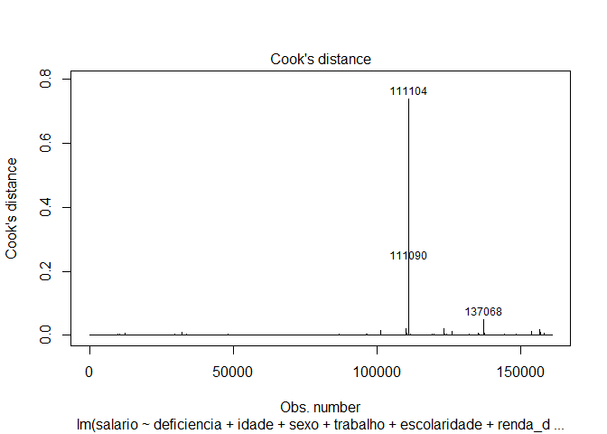<!-- -->

``` r
plot (regressao1, 5)
```

<!-- -->

``` r
outlierTest(regressao1)
```

    ##         rstudent unadjusted p-value Bonferroni p
    ## 109985  59.84277                  0            0
    ## 109988  60.02423                  0            0
    ## 110434  39.06437                  0            0
    ## 111090 175.08176                  0            0
    ## 111104 175.11283                  0            0
    ## 123432  39.43706                  0            0
    ## 126170  52.37406                  0            0
    ## 137068  90.49394                  0            0
    ## 153756  48.28962                  0            0
    ## 156570  53.70519                  0            0

``` r
# Retirar as observações influentes de acordo com o plot 5

regressao2 <- lm (salario ~ deficiencia + idade + sexo + trabalho + escolaridade + renda_domiciliar + cor + regiao, data = filtrado_idade [-c(111104, 137068, 111090),])
summary(regressao2)
```

    ## 
    ## Call:
    ## lm(formula = salario ~ deficiencia + idade + sexo + trabalho + 
    ##     escolaridade + renda_domiciliar + cor + regiao, data = filtrado_idade[-c(111104, 
    ##     137068, 111090), ])
    ## 
    ## Residuals:
    ##    Min     1Q Median     3Q    Max 
    ##  -4126   -542   -130    280 146453 
    ## 
    ## Coefficients:
    ##                                Estimate Std. Error  t value Pr(>|t|)    
    ## (Intercept)                   7.170e+02  2.435e+01   29.449  < 2e-16 ***
    ## deficienciadauditiva         -1.988e+02  3.690e+01   -5.387 7.19e-08 ***
    ## deficienciadvisual           -9.168e+01  2.566e+01   -3.572 0.000354 ***
    ## deficienciadintelectual       2.980e+01  5.626e+01    0.530 0.596371    
    ## deficienciadfísica           -1.990e+02  4.216e+01   -4.719 2.37e-06 ***
    ## idade                         1.060e+01  3.248e-01   32.636  < 2e-16 ***
    ## sexofeminino                 -4.369e+02  1.016e+01  -42.992  < 2e-16 ***
    ## trabalhonão                  -1.153e+03  1.110e+01 -103.878  < 2e-16 ***
    ## escolaridadefund_completo     2.114e+02  2.042e+01   10.351  < 2e-16 ***
    ## escolaridadefund_incompleto   7.576e+01  1.655e+01    4.579 4.69e-06 ***
    ## escolaridademédio_completo    3.990e+02  1.734e+01   23.014  < 2e-16 ***
    ## escolaridademédio_incompleto  2.400e+02  2.341e+01   10.252  < 2e-16 ***
    ## escolaridadesup_completo      2.494e+03  2.088e+01  119.415  < 2e-16 ***
    ## escolaridadesup_incompleto    5.992e+02  2.634e+01   22.754  < 2e-16 ***
    ## renda_domiciliar             -1.947e-02  5.191e-03   -3.751 0.000176 ***
    ## cornão_branco                -2.106e+02  1.096e+01  -19.221  < 2e-16 ***
    ## regiaoNorte                   1.316e+02  1.352e+01    9.735  < 2e-16 ***
    ## regiaoSudeste                 2.182e+02  1.379e+01   15.818  < 2e-16 ***
    ## regiaoSul                     2.181e+02  1.784e+01   12.223  < 2e-16 ***
    ## regiaoCentro-oeste            3.527e+02  1.675e+01   21.052  < 2e-16 ***
    ## ---
    ## Signif. codes:  0 '***' 0.001 '**' 0.01 '*' 0.05 '.' 0.1 ' ' 1
    ## 
    ## Residual standard error: 1960 on 160879 degrees of freedom
    ## Multiple R-squared:  0.2376, Adjusted R-squared:  0.2375 
    ## F-statistic:  2639 on 19 and 160879 DF,  p-value: < 2.2e-16

``` r
confint(regressao2)
```

    ##                                      2.5 %        97.5 %
    ## (Intercept)                   6.692825e+02  7.647237e+02
    ## deficienciadauditiva         -2.711005e+02 -1.264487e+02
    ## deficienciadvisual           -1.419869e+02 -4.138201e+01
    ## deficienciadintelectual      -8.047186e+01  1.400657e+02
    ## deficienciadfísica           -2.815896e+02 -1.163291e+02
    ## idade                         9.963288e+00  1.123644e+01
    ## sexofeminino                 -4.568200e+02 -4.169838e+02
    ## trabalhonão                  -1.174503e+03 -1.131002e+03
    ## escolaridadefund_completo     1.713520e+02  2.514036e+02
    ## escolaridadefund_incompleto   4.332980e+01  1.081949e+02
    ## escolaridademédio_completo    3.650507e+02  4.330185e+02
    ## escolaridademédio_incompleto  1.941236e+02  2.858884e+02
    ## escolaridadesup_completo      2.452805e+03  2.534666e+03
    ## escolaridadesup_incompleto    5.476265e+02  6.508638e+02
    ## renda_domiciliar             -2.964691e-02 -9.297763e-03
    ## cornão_branco                -2.320462e+02 -1.891007e+02
    ## regiaoNorte                   1.051021e+02  1.580940e+02
    ## regiaoSudeste                 1.911437e+02  2.452133e+02
    ## regiaoSul                     1.831104e+02  2.530472e+02
    ## regiaoCentro-oeste            3.198429e+02  3.855116e+02

``` r
# Homocedasticidade (Pressupostos sobre o componente estocástico da população) - o teste demonstra heterocedasticidade - Para resolver a heterocedasticidade: o resultado do p-valor do teste abaixo (coeftest) é mais confiável, ele ajusta os p-valores de acordo com os erros de cada observação. 

plot(regressao2, 3)
```

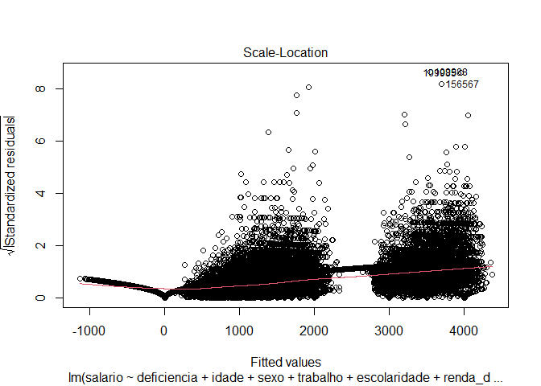<!-- -->

``` r
bptest(regressao2)
```

    ## 
    ##  studentized Breusch-Pagan test
    ## 
    ## data:  regressao2
    ## BP = 605.8, df = 19, p-value < 2.2e-16

``` r
ncvTest(regressao2) 
```

    ## Non-constant Variance Score Test 
    ## Variance formula: ~ fitted.values 
    ## Chisquare = 250518.2, Df = 1, p = < 2.22e-16

``` r
coeftest(regressao2, 
         vcov = vcovHC(regressao2, type = "HC3"))
```

    ## 
    ## t test of coefficients:
    ## 
    ##                                 Estimate  Std. Error   t value  Pr(>|t|)    
    ## (Intercept)                   7.1700e+02  1.9320e+01   37.1110 < 2.2e-16 ***
    ## deficienciadauditiva         -1.9877e+02  2.6394e+01   -7.5312 5.054e-14 ***
    ## deficienciadvisual           -9.1684e+01  2.6174e+01   -3.5029 0.0004603 ***
    ## deficienciadintelectual       2.9797e+01  1.6625e+01    1.7922 0.0730955 .  
    ## deficienciadfísica           -1.9896e+02  2.3971e+01   -8.2999 < 2.2e-16 ***
    ## idade                         1.0600e+01  3.5854e-01   29.5638 < 2.2e-16 ***
    ## sexofeminino                 -4.3690e+02  1.0564e+01  -41.3577 < 2.2e-16 ***
    ## trabalhonão                  -1.1528e+03  8.3779e+00 -137.5941 < 2.2e-16 ***
    ## escolaridadefund_completo     2.1138e+02  1.2126e+01   17.4324 < 2.2e-16 ***
    ## escolaridadefund_incompleto   7.5762e+01  7.4482e+00   10.1719 < 2.2e-16 ***
    ## escolaridademédio_completo    3.9903e+02  1.0449e+01   38.1882 < 2.2e-16 ***
    ## escolaridademédio_incompleto  2.4001e+02  1.3842e+01   17.3393 < 2.2e-16 ***
    ## escolaridadesup_completo      2.4937e+03  3.5678e+01   69.8951 < 2.2e-16 ***
    ## escolaridadesup_incompleto    5.9925e+02  2.1339e+01   28.0819 < 2.2e-16 ***
    ## renda_domiciliar             -1.9472e-02  1.2268e-02   -1.5872 0.1124584    
    ## cornão_branco                -2.1057e+02  1.1611e+01  -18.1352 < 2.2e-16 ***
    ## regiaoNorte                   1.3160e+02  1.0788e+01   12.1985 < 2.2e-16 ***
    ## regiaoSudeste                 2.1818e+02  1.3199e+01   16.5296 < 2.2e-16 ***
    ## regiaoSul                     2.1808e+02  1.9446e+01   11.2144 < 2.2e-16 ***
    ## regiaoCentro-oeste            3.5268e+02  1.8557e+01   19.0051 < 2.2e-16 ***
    ## ---
    ## Signif. codes:  0 '***' 0.001 '**' 0.01 '*' 0.05 '.' 0.1 ' ' 1

``` r
# Linearidade (pressuposto sobre a especificação do modelo) - OK 

plot(regressao2, 1)
```

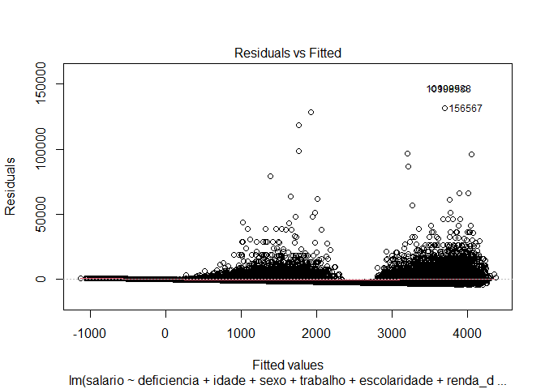<!-- -->

``` r
# Autocorrelação entre casos/resíduos (Pressupostos sobre o componente estocástico da população) - melhorou da regressão 1 para a 2, porém o teste demonstra que existe autocorrelação  

acf(regressao2$residuals)
```

<!-- -->

``` r
durbinWatsonTest(regressao2)
```

    ##  lag Autocorrelation D-W Statistic p-value
    ##    1       0.1283991      1.743201       0
    ##  Alternative hypothesis: rho != 0

``` r
# Normalidade dos Resíduos - não normal 

plot(regressao2, 2)
```

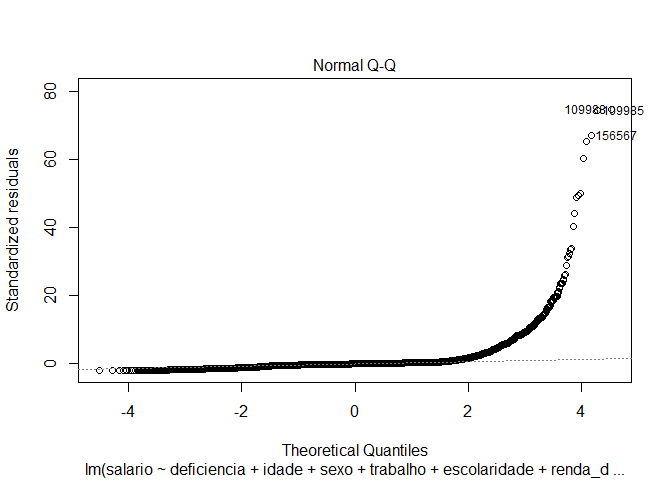<!-- -->

``` r
# Multicolinearidade (pressuposto sobre o componente estocástico da população) - O VIF não chega nem perto de 4, mas não existe um valor objetivo para definir o quão grave é a multicolinearidade, o 4 é apenas um parâmetro. A solução da multicolinearidade é aumentar o N, no caso dos dados isso não é possível. 

vif (regressao2)
```

    ##                      GVIF Df GVIF^(1/(2*Df))
    ## deficiencia      1.097712  4        1.011722
    ## idade            1.377457  1        1.173651
    ## sexo             1.079254  1        1.038871
    ## trabalho         1.226927  1        1.107667
    ## escolaridade     1.404585  6        1.028716
    ## renda_domiciliar 1.194438  1        1.092904
    ## cor              1.193959  1        1.092684
    ## regiao           1.190483  4        1.022034

### Pressupostos da regressão que testa a H2

``` r
# Regressão 3, com a variável de limitação como dependente

regressao3 <- lm (salario ~ limita + idade + sexo + trabalho + escolaridade + renda_domiciliar + cor + regiao + estadosaude, 
                  data = filtrado_idade)

summary(regressao3)
```

    ## 
    ## Call:
    ## lm(formula = salario ~ limita + idade + sexo + trabalho + escolaridade + 
    ##     renda_domiciliar + cor + regiao + estadosaude, data = filtrado_idade)
    ## 
    ## Residuals:
    ##    Min     1Q Median     3Q    Max 
    ##  -3678   -433     -5    257  41231 
    ## 
    ## Coefficients:
    ##                                Estimate Std. Error t value Pr(>|t|)    
    ## (Intercept)                   1.383e+03  1.353e+02  10.223  < 2e-16 ***
    ## limitamoderadamente          -1.610e+02  6.181e+01  -2.604 0.009226 ** 
    ## limitaintensamente           -1.646e+02  6.151e+01  -2.677 0.007456 ** 
    ## limitaum pouco               -1.637e+02  5.425e+01  -3.018 0.002560 ** 
    ## idade                         3.665e+00  1.412e+00   2.596 0.009456 ** 
    ## sexofeminino                 -3.068e+02  4.231e+01  -7.252 4.66e-13 ***
    ## trabalhonão                  -1.267e+03  4.994e+01 -25.364  < 2e-16 ***
    ## escolaridadefund_completo    -5.672e+01  8.177e+01  -0.694 0.487952    
    ## escolaridadefund_incompleto  -3.235e+01  5.357e+01  -0.604 0.545873    
    ## escolaridademédio_completo    2.248e+02  6.913e+01   3.251 0.001156 ** 
    ## escolaridademédio_incompleto  4.407e+01  1.288e+02   0.342 0.732306    
    ## escolaridadesup_completo      2.211e+03  8.928e+01  24.767  < 2e-16 ***
    ## escolaridadesup_incompleto    4.375e+02  1.464e+02   2.989 0.002814 ** 
    ## renda_domiciliar              2.025e-02  1.506e-02   1.344 0.178848    
    ## cornão_branco                -1.363e+02  4.581e+01  -2.977 0.002928 ** 
    ## regiaoNorte                   6.505e+01  5.986e+01   1.087 0.277223    
    ## regiaoSudeste                 2.291e+02  6.009e+01   3.813 0.000139 ***
    ## regiaoSul                     9.629e+01  6.835e+01   1.409 0.158963    
    ## regiaoCentro-oeste            1.185e+02  7.037e+01   1.684 0.092241 .  
    ## estadosauderegular           -2.456e+02  9.524e+01  -2.579 0.009938 ** 
    ## estadosaudeboa               -1.637e+02  9.353e+01  -1.751 0.080061 .  
    ## estadosauderuim              -1.555e+02  1.082e+02  -1.437 0.150721    
    ## estadosaudemuito ruim        -2.826e+02  1.380e+02  -2.048 0.040586 *  
    ## ---
    ## Signif. codes:  0 '***' 0.001 '**' 0.01 '*' 0.05 '.' 0.1 ' ' 1
    ## 
    ## Residual standard error: 1520 on 5501 degrees of freedom
    ##   (155378 observations deleted due to missingness)
    ## Multiple R-squared:  0.3059, Adjusted R-squared:  0.3031 
    ## F-statistic: 110.2 on 22 and 5501 DF,  p-value: < 2.2e-16

``` r
confint(regressao3)
```

    ##                                      2.5 %        97.5 %
    ## (Intercept)                   1.117698e+03  1.648063e+03
    ## limitamoderadamente          -2.821772e+02 -3.981420e+01
    ## limitaintensamente           -2.852243e+02 -4.406201e+01
    ## limitaum pouco               -2.700711e+02 -5.735446e+01
    ## idade                         8.973873e-01  6.432641e+00
    ## sexofeminino                 -3.897607e+02 -2.238846e+02
    ## trabalhonão                  -1.364438e+03 -1.168652e+03
    ## escolaridadefund_completo    -2.170318e+02  1.035908e+02
    ## escolaridadefund_incompleto  -1.373699e+02  7.266008e+01
    ## escolaridademédio_completo    8.923446e+01  3.602907e+02
    ## escolaridademédio_incompleto -2.084725e+02  2.966055e+02
    ## escolaridadesup_completo      2.036108e+03  2.386141e+03
    ## escolaridadesup_incompleto    1.505416e+02  7.245469e+02
    ## renda_domiciliar             -9.275893e-03  4.977278e-02
    ## cornão_branco                -2.261409e+02 -4.654526e+01
    ## regiaoNorte                  -5.229865e+01  1.823931e+02
    ## regiaoSudeste                 1.113326e+02  3.469216e+02
    ## regiaoSul                    -3.770517e+01  2.302859e+02
    ## regiaoCentro-oeste           -1.945021e+01  2.564469e+02
    ## estadosauderegular           -4.323159e+02 -5.890269e+01
    ## estadosaudeboa               -3.471059e+02  1.961773e+01
    ## estadosauderuim              -3.677059e+02  5.662446e+01
    ## estadosaudemuito ruim        -5.531136e+02 -1.211811e+01

``` r
# Outlier/Observação influente = 101225 (outlier), 135443 e 148567 (influentes)

plot (regressao3, 4)
```

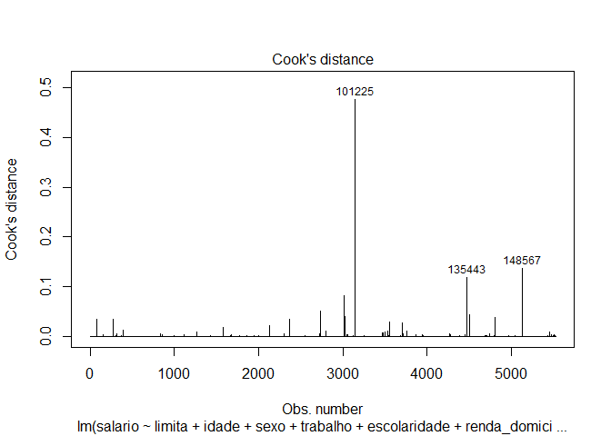<!-- -->

``` r
plot (regressao3, 5)
```

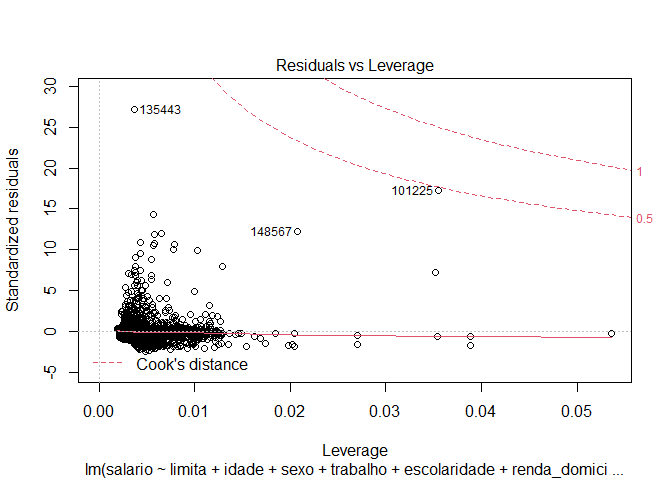<!-- -->

``` r
outlierTest(regressao3)
```

    ##        rstudent unadjusted p-value Bonferroni p
    ## 135443 29.20005        2.1877e-174  1.2085e-170
    ## 101225 17.71285         2.5571e-68   1.4125e-64
    ## 87216  14.53232         5.5633e-47   3.0731e-43
    ## 148567 12.34795         1.4297e-34   7.8979e-31
    ## 96809  12.16774         1.2450e-33   6.8775e-30
    ## 77048  11.99424         9.7273e-33   5.3733e-29
    ## 69771  11.05174         4.2403e-28   2.3424e-24
    ## 112088 10.86584         3.1647e-27   1.7482e-23
    ## 140824 10.73514         1.2757e-26   7.0469e-23
    ## 117659 10.66944         2.5553e-26   1.4115e-22

``` r
# Retirar as observações influentes de acordo com o plot 5

regressao4 <- lm (salario ~ limita + idade + sexo + trabalho + escolaridade + renda_domiciliar + cor + regiao + estadosaude, data = filtrado_idade [-c(101225, 135443, 148567), ] )
summary(regressao4)
```

    ## 
    ## Call:
    ## lm(formula = salario ~ limita + idade + sexo + trabalho + escolaridade + 
    ##     renda_domiciliar + cor + regiao + estadosaude, data = filtrado_idade[-c(101225, 
    ##     135443, 148567), ])
    ## 
    ## Residuals:
    ##     Min      1Q  Median      3Q     Max 
    ## -3621.8  -403.9    -8.0   241.9 21651.5 
    ## 
    ## Coefficients:
    ##                                Estimate Std. Error t value Pr(>|t|)    
    ## (Intercept)                   1.357e+03  1.197e+02  11.333  < 2e-16 ***
    ## limitamoderadamente          -1.271e+02  5.471e+01  -2.324 0.020180 *  
    ## limitaintensamente           -1.352e+02  5.444e+01  -2.483 0.013069 *  
    ## limitaum pouco               -1.298e+02  4.802e+01  -2.702 0.006905 ** 
    ## idade                         4.664e+00  1.250e+00   3.730 0.000194 ***
    ## sexofeminino                 -2.890e+02  3.744e+01  -7.718 1.39e-14 ***
    ## trabalhonão                  -1.204e+03  4.425e+01 -27.209  < 2e-16 ***
    ## escolaridadefund_completo    -1.977e+01  7.238e+01  -0.273 0.784711    
    ## escolaridadefund_incompleto  -1.269e+01  4.741e+01  -0.268 0.789009    
    ## escolaridademédio_completo    2.738e+02  6.120e+01   4.474 7.83e-06 ***
    ## escolaridademédio_incompleto -2.129e+01  1.142e+02  -0.186 0.852149    
    ## escolaridadesup_completo      2.184e+03  7.909e+01  27.615  < 2e-16 ***
    ## escolaridadesup_incompleto    4.711e+02  1.296e+02   3.636 0.000279 ***
    ## renda_domiciliar             -4.926e-02  1.363e-02  -3.613 0.000305 ***
    ## cornão_branco                -1.441e+02  4.054e+01  -3.554 0.000383 ***
    ## regiaoNorte                   6.848e+01  5.297e+01   1.293 0.196147    
    ## regiaoSudeste                 2.212e+02  5.318e+01   4.159 3.24e-05 ***
    ## regiaoSul                     7.626e+01  6.051e+01   1.260 0.207581    
    ## regiaoCentro-oeste            1.016e+02  6.230e+01   1.631 0.103029    
    ## estadosauderegular           -3.027e+02  8.429e+01  -3.591 0.000332 ***
    ## estadosaudeboa               -2.417e+02  8.279e+01  -2.920 0.003518 ** 
    ## estadosauderuim              -2.280e+02  9.579e+01  -2.380 0.017332 *  
    ## estadosaudemuito ruim        -3.516e+02  1.221e+02  -2.879 0.004001 ** 
    ## ---
    ## Signif. codes:  0 '***' 0.001 '**' 0.01 '*' 0.05 '.' 0.1 ' ' 1
    ## 
    ## Residual standard error: 1345 on 5498 degrees of freedom
    ##   (155378 observations deleted due to missingness)
    ## Multiple R-squared:  0.3414, Adjusted R-squared:  0.3388 
    ## F-statistic: 129.5 on 22 and 5498 DF,  p-value: < 2.2e-16

``` r
confint(regressao4)
```

    ##                                      2.5 %        97.5 %
    ## (Intercept)                   1.122146e+03  1.591552e+03
    ## limitamoderadamente          -2.343820e+02 -1.987456e+01
    ## limitaintensamente           -2.418678e+02 -2.843234e+01
    ## limitaum pouco               -2.239068e+02 -3.563187e+01
    ## idade                         2.212420e+00  7.114800e+00
    ## sexofeminino                 -3.623783e+02 -2.155762e+02
    ## trabalhonão                  -1.290632e+03 -1.117152e+03
    ## escolaridadefund_completo    -1.616573e+02  1.221117e+02
    ## escolaridadefund_incompleto  -1.056246e+02  8.025103e+01
    ## escolaridademédio_completo    1.538458e+02  3.938136e+02
    ## escolaridademédio_incompleto -2.452566e+02  2.026698e+02
    ## escolaridadesup_completo      2.029032e+03  2.339130e+03
    ## escolaridadesup_incompleto    2.171283e+02  7.251016e+02
    ## renda_domiciliar             -7.599401e-02 -2.253575e-02
    ## cornão_branco                -2.235412e+02 -6.458727e+01
    ## regiaoNorte                  -3.536453e+01  1.723205e+02
    ## regiaoSudeste                 1.169331e+02  3.254282e+02
    ## regiaoSul                    -4.235425e+01  1.948768e+02
    ## regiaoCentro-oeste           -2.054425e+01  2.237091e+02
    ## estadosauderegular           -4.679777e+02 -1.374817e+02
    ## estadosaudeboa               -4.040438e+02 -7.942284e+01
    ## estadosauderuim              -4.158051e+02 -4.022513e+01
    ## estadosaudemuito ruim        -5.910047e+02 -1.122103e+02

``` r
# Homocedasticidade - (Pressupostos sobre o componente estocástico da população) - o teste demonstra heterocedasticidade - Para resolver a heterocedasticidade: o resultado do p-valor do teste abaixo (coeftest) é mais confiável, ele ajusta os p-valores de acordo com os erros de cada observação.

plot(regressao4, 3)
```

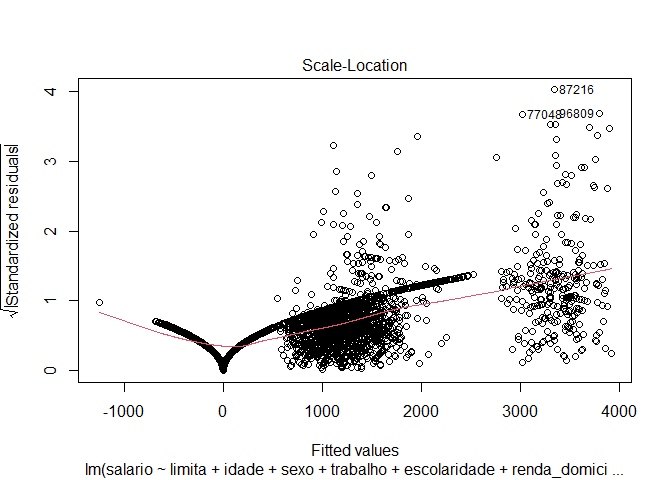<!-- -->

``` r
bptest(regressao4)
```

    ## 
    ##  studentized Breusch-Pagan test
    ## 
    ## data:  regressao4
    ## BP = 442.99, df = 22, p-value < 2.2e-16

``` r
ncvTest(regressao4) 
```

    ## Non-constant Variance Score Test 
    ## Variance formula: ~ fitted.values 
    ## Chisquare = 12059.12, Df = 1, p = < 2.22e-16

``` r
coeftest(regressao4, 
         vcov = vcovHC(regressao4, type = "HC3"))
```

    ## 
    ## t test of coefficients:
    ## 
    ##                                 Estimate  Std. Error  t value  Pr(>|t|)    
    ## (Intercept)                   1.3568e+03  1.6650e+02   8.1491 4.501e-16 ***
    ## limitamoderadamente          -1.2713e+02  5.5218e+01  -2.3023 0.0213552 *  
    ## limitaintensamente           -1.3515e+02  4.6076e+01  -2.9332 0.0033684 ** 
    ## limitaum pouco               -1.2977e+02  5.1958e+01  -2.4976 0.0125330 *  
    ## idade                         4.6636e+00  1.2110e+00   3.8511 0.0001189 ***
    ## sexofeminino                 -2.8898e+02  3.6999e+01  -7.8103 6.785e-15 ***
    ## trabalhonão                  -1.2039e+03  4.8624e+01 -24.7593 < 2.2e-16 ***
    ## escolaridadefund_completo    -1.9773e+01  4.0380e+01  -0.4897 0.6243892    
    ## escolaridadefund_incompleto  -1.2687e+01  2.2767e+01  -0.5573 0.5773769    
    ## escolaridademédio_completo    2.7383e+02  4.8442e+01   5.6527 1.659e-08 ***
    ## escolaridademédio_incompleto -2.1293e+01  5.8265e+01  -0.3655 0.7147844    
    ## escolaridadesup_completo      2.1841e+03  1.8200e+02  12.0008 < 2.2e-16 ***
    ## escolaridadesup_incompleto    4.7111e+02  1.6629e+02   2.8331 0.0046273 ** 
    ## renda_domiciliar             -4.9265e-02  3.2351e-02  -1.5228 0.1278603    
    ## cornão_branco                -1.4406e+02  3.6459e+01  -3.9514 7.868e-05 ***
    ## regiaoNorte                   6.8478e+01  4.8264e+01   1.4188 0.1560116    
    ## regiaoSudeste                 2.2118e+02  5.4869e+01   4.0311 5.627e-05 ***
    ## regiaoSul                     7.6261e+01  5.7952e+01   1.3159 0.1882459    
    ## regiaoCentro-oeste            1.0158e+02  4.9627e+01   2.0469 0.0407147 *  
    ## estadosauderegular           -3.0273e+02  1.3694e+02  -2.2107 0.0270944 *  
    ## estadosaudeboa               -2.4173e+02  1.3808e+02  -1.7507 0.0800497 .  
    ## estadosauderuim              -2.2802e+02  1.4675e+02  -1.5538 0.1202861    
    ## estadosaudemuito ruim        -3.5161e+02  1.3929e+02  -2.5243 0.0116193 *  
    ## ---
    ## Signif. codes:  0 '***' 0.001 '**' 0.01 '*' 0.05 '.' 0.1 ' ' 1

``` r
# Linearidade (pressuposto sobre a especificação do modelo) - OK

plot(regressao4, 1)
```

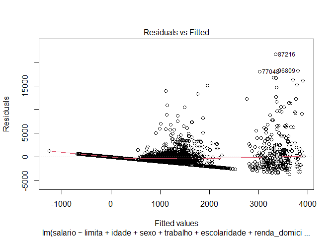<!-- -->

``` r
# Autocorrelação entre casos/resíduos Pressupostos sobre o componente estocástico da população) - nem a regressão 3 e nem a 4 têm autocorrelação


acf(regressao4$residuals)
```

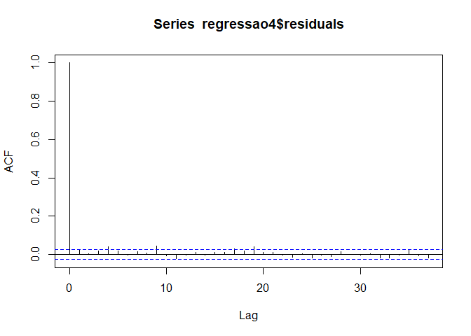<!-- -->

``` r
durbinWatsonTest(regressao4)
```

    ##  lag Autocorrelation D-W Statistic p-value
    ##    1      0.02368741      1.952579    0.09
    ##  Alternative hypothesis: rho != 0

``` r
# Normalidade dos Resíduos - não normal


plot(regressao4, 2)
```

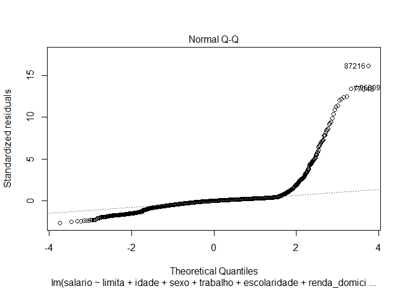<!-- -->

``` r
# Multicolinearidade (pressuposto sobre o componente estocástico da população) - O VIF não chega nem perto de 4, mas não existe um valor objetivo para definir o quão grave é a multicolinearidade, o 4 é apenas um parâmetro. A solução da multicolinearidade é aumentar o N, no caso dos dados isso não é possível. 

vif (regressao4)
```

    ##                      GVIF Df GVIF^(1/(2*Df))
    ## limita           1.245784  3        1.037307
    ## idade            1.456454  1        1.206836
    ## sexo             1.064803  1        1.031893
    ## trabalho         1.453742  1        1.205712
    ## escolaridade     1.523478  6        1.035706
    ## renda_domiciliar 1.233460  1        1.110612
    ## cor              1.228480  1        1.108368
    ## regiao           1.282237  4        1.031564
    ## estadosaude      1.313947  4        1.034719

### Pressupostos da regressão que testa a H3

``` r
# Regressão 5 com interação entre sexo e deficiência 

regressao5 <- lm (salario ~ deficiencia + idade + sexo + trabalho + escolaridade + renda_domiciliar + cor + regiao + deficiencia * sexo, data = filtrado_idade)
summary(regressao5)
```

    ## 
    ## Call:
    ## lm(formula = salario ~ deficiencia + idade + sexo + trabalho + 
    ##     escolaridade + renda_domiciliar + cor + regiao + deficiencia * 
    ##     sexo, data = filtrado_idade)
    ## 
    ## Residuals:
    ##    Min     1Q Median     3Q    Max 
    ##  -4213   -552   -130    288 395705 
    ## 
    ## Coefficients:
    ##                                        Estimate Std. Error t value Pr(>|t|)    
    ## (Intercept)                           7.306e+02  3.070e+01  23.801  < 2e-16 ***
    ## deficienciadauditiva                 -3.268e+02  6.238e+01  -5.239 1.61e-07 ***
    ## deficienciadvisual                   -1.617e+02  4.897e+01  -3.302 0.000960 ***
    ## deficienciadintelectual              -1.361e+02  9.457e+01  -1.440 0.149989    
    ## deficienciadfísica                   -3.492e+02  6.820e+01  -5.120 3.05e-07 ***
    ## idade                                 1.063e+01  4.088e-01  25.997  < 2e-16 ***
    ## sexofeminino                         -4.645e+02  1.329e+01 -34.947  < 2e-16 ***
    ## trabalhonão                          -1.167e+03  1.397e+01 -83.530  < 2e-16 ***
    ## escolaridadefund_completo             2.119e+02  2.570e+01   8.246  < 2e-16 ***
    ## escolaridadefund_incompleto           7.573e+01  2.082e+01   3.636 0.000277 ***
    ## escolaridademédio_completo            3.963e+02  2.182e+01  18.160  < 2e-16 ***
    ## escolaridademédio_incompleto          2.441e+02  2.946e+01   8.287  < 2e-16 ***
    ## escolaridadesup_completo              2.531e+03  2.628e+01  96.310  < 2e-16 ***
    ## escolaridadesup_incompleto            5.983e+02  3.314e+01  18.051  < 2e-16 ***
    ## renda_domiciliar                      1.053e-02  6.531e-03   1.613 0.106846    
    ## cornão_branco                        -2.157e+02  1.379e+01 -15.646  < 2e-16 ***
    ## regiaoNorte                           1.333e+02  1.701e+01   7.833 4.80e-15 ***
    ## regiaoSudeste                         2.326e+02  1.736e+01  13.398  < 2e-16 ***
    ## regiaoSul                             2.178e+02  2.245e+01   9.701  < 2e-16 ***
    ## regiaoCentro-oeste                    3.466e+02  2.108e+01  16.441  < 2e-16 ***
    ## deficienciadauditiva:sexofeminino     2.339e+02  9.184e+01   2.546 0.010885 *  
    ## deficienciadvisual:sexofeminino       1.016e+02  6.439e+01   1.578 0.114619    
    ## deficienciadintelectual:sexofeminino  3.579e+02  1.409e+02   2.541 0.011060 *  
    ## deficienciadfísica:sexofeminino       3.357e+02  1.076e+02   3.120 0.001809 ** 
    ## ---
    ## Signif. codes:  0 '***' 0.001 '**' 0.01 '*' 0.05 '.' 0.1 ' ' 1
    ## 
    ## Residual standard error: 2466 on 160878 degrees of freedom
    ## Multiple R-squared:  0.1692, Adjusted R-squared:  0.1691 
    ## F-statistic:  1424 on 23 and 160878 DF,  p-value: < 2.2e-16

``` r
confint(regressao5)
```

    ##                                              2.5 %        97.5 %
    ## (Intercept)                           6.704020e+02  7.907260e+02
    ## deficienciadauditiva                 -4.491099e+02 -2.045755e+02
    ## deficienciadvisual                   -2.576833e+02 -6.572076e+01
    ## deficienciadintelectual              -3.215108e+02  4.921668e+01
    ## deficienciadfísica                   -4.828404e+02 -2.155174e+02
    ## idade                                 9.825655e+00  1.142804e+01
    ## sexofeminino                         -4.905511e+02 -4.384492e+02
    ## trabalhonão                          -1.194143e+03 -1.139389e+03
    ## escolaridadefund_completo             1.615607e+02  2.623029e+02
    ## escolaridadefund_incompleto           3.491124e+01  1.165427e+02
    ## escolaridademédio_completo            3.534944e+02  4.390321e+02
    ## escolaridademédio_incompleto          1.863877e+02  3.018714e+02
    ## escolaridadesup_completo              2.479644e+03  2.582666e+03
    ## escolaridadesup_incompleto            5.333299e+02  6.632521e+02
    ## renda_domiciliar                     -2.269240e-03  2.333349e-02
    ## cornão_branco                        -2.427418e+02 -1.886942e+02
    ## regiaoNorte                           9.991327e+01  1.666023e+02
    ## regiaoSudeste                         1.985445e+02  2.665890e+02
    ## regiaoSul                             1.738118e+02  2.618247e+02
    ## regiaoCentro-oeste                    3.052918e+02  3.879333e+02
    ## deficienciadauditiva:sexofeminino     5.385696e+01  4.138646e+02
    ## deficienciadvisual:sexofeminino      -2.461090e+01  2.278037e+02
    ## deficienciadintelectual:sexofeminino  8.181940e+01  6.339918e+02
    ## deficienciadfísica:sexofeminino       1.248256e+02  5.466578e+02

``` r
# Outlier/Observação influente = 111104 e 111090 (outliers), 137068 (influente)

plot (regressao5, 4)
```

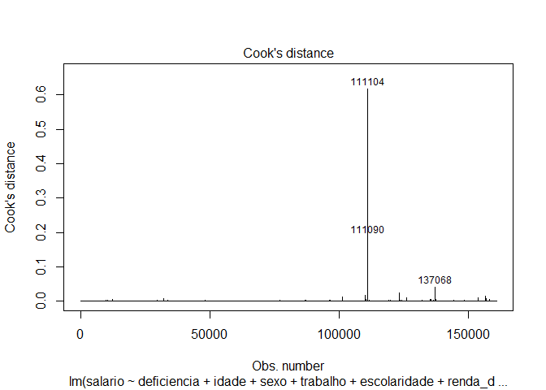<!-- -->

``` r
plot (regressao5, 5)
```

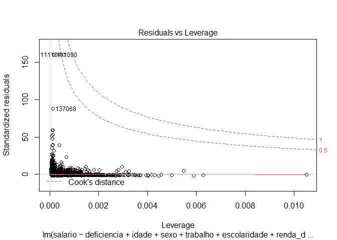<!-- -->

``` r
outlierTest(regressao5)
```

    ##         rstudent unadjusted p-value Bonferroni p
    ## 109985  59.84319                  0            0
    ## 109988  60.02427                  0            0
    ## 110434  39.06360                  0            0
    ## 111090 175.09087                  0            0
    ## 111104 175.12152                  0            0
    ## 123432  39.42664                  0            0
    ## 126170  52.37458                  0            0
    ## 137068  90.49673                  0            0
    ## 153756  48.28989                  0            0
    ## 156570  53.71184                  0            0

``` r
# Retirar as observações influentes de acordo com o plot 5

regressao6 <- lm (salario ~ deficiencia + idade + sexo + trabalho + escolaridade + renda_domiciliar + cor + regiao + deficiencia * sexo, data = filtrado_idade [-c(111104, 137068, 111090), ])
summary(regressao6)
```

    ## 
    ## Call:
    ## lm(formula = salario ~ deficiencia + idade + sexo + trabalho + 
    ##     escolaridade + renda_domiciliar + cor + regiao + deficiencia * 
    ##     sexo, data = filtrado_idade[-c(111104, 137068, 111090), ])
    ## 
    ## Residuals:
    ##    Min     1Q Median     3Q    Max 
    ##  -4133   -542   -128    280 146445 
    ## 
    ## Coefficients:
    ##                                        Estimate Std. Error  t value Pr(>|t|)
    ## (Intercept)                           7.245e+02  2.439e+01   29.707  < 2e-16
    ## deficienciadauditiva                 -2.978e+02  4.957e+01   -6.009 1.87e-09
    ## deficienciadvisual                   -1.384e+02  3.891e+01   -3.557 0.000375
    ## deficienciadintelectual              -1.251e+02  7.514e+01   -1.665 0.095846
    ## deficienciadfísica                   -3.289e+02  5.418e+01   -6.071 1.28e-09
    ## idade                                 1.057e+01  3.248e-01   32.559  < 2e-16
    ## sexofeminino                         -4.513e+02  1.056e+01  -42.731  < 2e-16
    ## trabalhonão                          -1.152e+03  1.110e+01 -103.770  < 2e-16
    ## escolaridadefund_completo             2.112e+02  2.042e+01   10.343  < 2e-16
    ## escolaridadefund_incompleto           7.596e+01  1.655e+01    4.591 4.41e-06
    ## escolaridademédio_completo            3.995e+02  1.734e+01   23.044  < 2e-16
    ## escolaridademédio_incompleto          2.401e+02  2.341e+01   10.257  < 2e-16
    ## escolaridadesup_completo              2.495e+03  2.088e+01  119.473  < 2e-16
    ## escolaridadesup_incompleto            5.998e+02  2.633e+01   22.778  < 2e-16
    ## renda_domiciliar                     -1.934e-02  5.191e-03   -3.725 0.000195
    ## cornão_branco                        -2.101e+02  1.096e+01  -19.180  < 2e-16
    ## regiaoNorte                           1.316e+02  1.352e+01    9.735  < 2e-16
    ## regiaoSudeste                         2.182e+02  1.379e+01   15.821  < 2e-16
    ## regiaoSul                             2.176e+02  1.784e+01   12.198  < 2e-16
    ## regiaoCentro-oeste                    3.526e+02  1.675e+01   21.048  < 2e-16
    ## deficienciadauditiva:sexofeminino     2.175e+02  7.297e+01    2.980 0.002879
    ## deficienciadvisual:sexofeminino       8.317e+01  5.116e+01    1.626 0.104051
    ## deficienciadintelectual:sexofeminino  3.458e+02  1.119e+02    3.089 0.002006
    ## deficienciadfísica:sexofeminino       3.232e+02  8.550e+01    3.780 0.000157
    ##                                         
    ## (Intercept)                          ***
    ## deficienciadauditiva                 ***
    ## deficienciadvisual                   ***
    ## deficienciadintelectual              .  
    ## deficienciadfísica                   ***
    ## idade                                ***
    ## sexofeminino                         ***
    ## trabalhonão                          ***
    ## escolaridadefund_completo            ***
    ## escolaridadefund_incompleto          ***
    ## escolaridademédio_completo           ***
    ## escolaridademédio_incompleto         ***
    ## escolaridadesup_completo             ***
    ## escolaridadesup_incompleto           ***
    ## renda_domiciliar                     ***
    ## cornão_branco                        ***
    ## regiaoNorte                          ***
    ## regiaoSudeste                        ***
    ## regiaoSul                            ***
    ## regiaoCentro-oeste                   ***
    ## deficienciadauditiva:sexofeminino    ** 
    ## deficienciadvisual:sexofeminino         
    ## deficienciadintelectual:sexofeminino ** 
    ## deficienciadfísica:sexofeminino      ***
    ## ---
    ## Signif. codes:  0 '***' 0.001 '**' 0.01 '*' 0.05 '.' 0.1 ' ' 1
    ## 
    ## Residual standard error: 1959 on 160875 degrees of freedom
    ## Multiple R-squared:  0.2378, Adjusted R-squared:  0.2377 
    ## F-statistic:  2182 on 23 and 160875 DF,  p-value: < 2.2e-16

``` r
confint(regressao6)
```

    ##                                              2.5 %        97.5 %
    ## (Intercept)                           6.767271e+02  7.723306e+02
    ## deficienciadauditiva                 -3.949807e+02 -2.006861e+02
    ## deficienciadvisual                   -2.146778e+02 -6.215418e+01
    ## deficienciadintelectual              -2.724206e+02  2.214002e+01
    ## deficienciadfísica                   -4.351351e+02 -2.227341e+02
    ## idade                                 9.938328e+00  1.121152e+01
    ## sexofeminino                         -4.719689e+02 -4.305710e+02
    ## trabalhonão                          -1.173445e+03 -1.129939e+03
    ## escolaridadefund_completo             1.711879e+02  2.512324e+02
    ## escolaridadefund_incompleto           4.353446e+01  1.083945e+02
    ## escolaridademédio_completo            3.655524e+02  4.335163e+02
    ## escolaridademédio_incompleto          1.942036e+02  2.859609e+02
    ## escolaridadesup_completo              2.453942e+03  2.535799e+03
    ## escolaridadesup_incompleto            5.482157e+02  6.514452e+02
    ## renda_domiciliar                     -2.951266e-02 -9.164470e-03
    ## cornão_branco                        -2.315851e+02 -1.886417e+02
    ## regiaoNorte                           1.051031e+02  1.580907e+02
    ## regiaoSudeste                         1.911679e+02  2.452329e+02
    ## regiaoSul                             1.826390e+02  2.525706e+02
    ## regiaoCentro-oeste                    3.197369e+02  3.853995e+02
    ## deficienciadauditiva:sexofeminino     7.446256e+01  3.605058e+02
    ## deficienciadvisual:sexofeminino      -1.711103e+01  1.834445e+02
    ## deficienciadintelectual:sexofeminino  1.264138e+02  5.651410e+02
    ## deficienciadfísica:sexofeminino       1.556551e+02  4.908208e+02

``` r
# Homocedasticidade (Pressupostos sobre o componente estocástico da população) - o teste demonstra heterocedasticidade - Para resolver a heterocedasticidade: o resultado do p-valor do teste abaixo (coeftest) é mais confiável, ele ajusta os p-valores de acordo com os erros de cada observação.

plot(regressao6, 3)
```

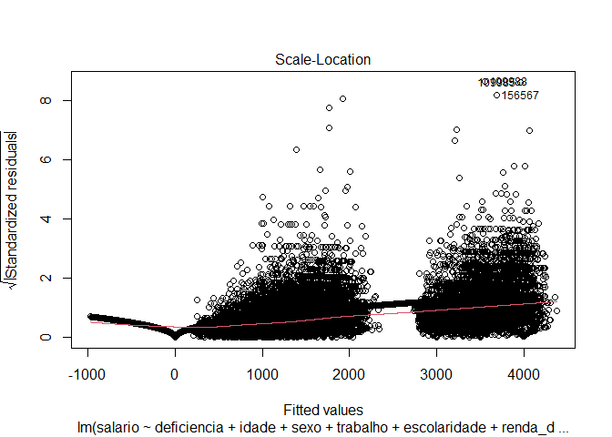<!-- -->

``` r
bptest(regressao6)
```

    ## 
    ##  studentized Breusch-Pagan test
    ## 
    ## data:  regressao6
    ## BP = 608.14, df = 23, p-value < 2.2e-16

``` r
ncvTest(regressao6) 
```

    ## Non-constant Variance Score Test 
    ## Variance formula: ~ fitted.values 
    ## Chisquare = 251115.9, Df = 1, p = < 2.22e-16

``` r
coeftest(regressao6, 
         vcov = vcovHC(regressao6, type = "HC3"))
```

    ## 
    ## t test of coefficients:
    ## 
    ##                                         Estimate  Std. Error   t value
    ## (Intercept)                           7.2453e+02  1.9346e+01   37.4509
    ## deficienciadauditiva                 -2.9783e+02  3.9297e+01   -7.5790
    ## deficienciadvisual                   -1.3842e+02  4.1204e+01   -3.3593
    ## deficienciadintelectual              -1.2514e+02  2.0402e+01   -6.1336
    ## deficienciadfísica                   -3.2893e+02  2.8579e+01  -11.5098
    ## idade                                 1.0575e+01  3.5837e-01   29.5086
    ## sexofeminino                         -4.5127e+02  1.1161e+01  -40.4319
    ## trabalhonão                          -1.1517e+03  8.3832e+00 -137.3817
    ## escolaridadefund_completo             2.1121e+02  1.2123e+01   17.4218
    ## escolaridadefund_incompleto           7.5964e+01  7.4443e+00   10.2044
    ## escolaridademédio_completo            3.9953e+02  1.0453e+01   38.2222
    ## escolaridademédio_incompleto          2.4008e+02  1.3845e+01   17.3413
    ## escolaridadesup_completo              2.4949e+03  3.5699e+01   69.8866
    ## escolaridadesup_incompleto            5.9983e+02  2.1341e+01   28.1069
    ## renda_domiciliar                     -1.9339e-02  1.2269e-02   -1.5762
    ## cornão_branco                        -2.1011e+02  1.1610e+01  -18.0977
    ## regiaoNorte                           1.3160e+02  1.0787e+01   12.1991
    ## regiaoSudeste                         2.1820e+02  1.3198e+01   16.5326
    ## regiaoSul                             2.1760e+02  1.9433e+01   11.1976
    ## regiaoCentro-oeste                    3.5257e+02  1.8555e+01   19.0014
    ## deficienciadauditiva:sexofeminino     2.1748e+02  4.9498e+01    4.3938
    ## deficienciadvisual:sexofeminino       8.3167e+01  5.1679e+01    1.6093
    ## deficienciadintelectual:sexofeminino  3.4578e+02  3.2470e+01   10.6490
    ## deficienciadfísica:sexofeminino       3.2324e+02  4.8966e+01    6.6012
    ##                                       Pr(>|t|)    
    ## (Intercept)                          < 2.2e-16 ***
    ## deficienciadauditiva                 3.500e-14 ***
    ## deficienciadvisual                   0.0007817 ***
    ## deficienciadintelectual              8.609e-10 ***
    ## deficienciadfísica                   < 2.2e-16 ***
    ## idade                                < 2.2e-16 ***
    ## sexofeminino                         < 2.2e-16 ***
    ## trabalhonão                          < 2.2e-16 ***
    ## escolaridadefund_completo            < 2.2e-16 ***
    ## escolaridadefund_incompleto          < 2.2e-16 ***
    ## escolaridademédio_completo           < 2.2e-16 ***
    ## escolaridademédio_incompleto         < 2.2e-16 ***
    ## escolaridadesup_completo             < 2.2e-16 ***
    ## escolaridadesup_incompleto           < 2.2e-16 ***
    ## renda_domiciliar                     0.1149891    
    ## cornão_branco                        < 2.2e-16 ***
    ## regiaoNorte                          < 2.2e-16 ***
    ## regiaoSudeste                        < 2.2e-16 ***
    ## regiaoSul                            < 2.2e-16 ***
    ## regiaoCentro-oeste                   < 2.2e-16 ***
    ## deficienciadauditiva:sexofeminino    1.115e-05 ***
    ## deficienciadvisual:sexofeminino      0.1075512    
    ## deficienciadintelectual:sexofeminino < 2.2e-16 ***
    ## deficienciadfísica:sexofeminino      4.090e-11 ***
    ## ---
    ## Signif. codes:  0 '***' 0.001 '**' 0.01 '*' 0.05 '.' 0.1 ' ' 1

``` r
# Linearidade (pressuposto sobre a especificação do modelo) - OK

plot(regressao6, 1)
```

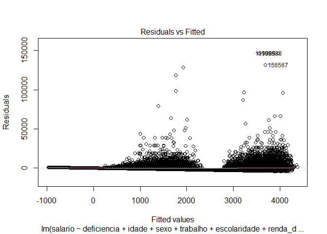<!-- -->

``` r
# Autocorrelação entre casos/resíduos (Pressupostos sobre o componente estocástico da população) - melhorou da regressão 5 para a 6, porém o teste demonstra que existe autocorrelação  


acf(regressao6$residuals)
```

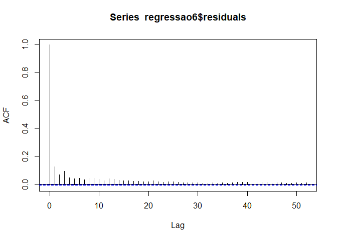<!-- -->

``` r
durbinWatsonTest(regressao6)
```

    ##  lag Autocorrelation D-W Statistic p-value
    ##    1       0.1285041      1.742991       0
    ##  Alternative hypothesis: rho != 0

``` r
# Normalidade dos Resíduos - não normal


plot(regressao6, 2)
```

<!-- -->

``` r
# Multicolinearidade (pressuposto sobre o componente estocástico da população) -  Não existe um valor objetivo para definir o quão grave é a multicolinearidade, o 4 é apenas um parâmetro. A solução da multicolinearidade é aumentar o N, no caso dos dados isso não é possível. Nessa regressão a deficiência apresenta alta multicolinearide devido à interação. 

vif (regressao6)
```

    ##                       GVIF Df GVIF^(1/(2*Df))
    ## deficiencia      13.455198  4        1.383921
    ## idade             1.377799  1        1.173797
    ## sexo              1.165744  1        1.079696
    ## trabalho          1.227440  1        1.107899
    ## escolaridade      1.405027  6        1.028743
    ## renda_domiciliar  1.194547  1        1.092953
    ## cor               1.194065  1        1.092733
    ## regiao            1.190588  4        1.022045
    ## deficiencia:sexo 13.289354  4        1.381777

### Abstract:

Does disability impact people’s income? Do all types of disabilities
impact or not? The main purpose of this article is to answer these
questions. For this, data from the National Health Survey (PNS), IBGE /
2013, and the approach of the linear least-squares regression model
(OLS) will be used. With this work I hope to contribute to the
literature in question. **Keywords:**disability, People with
Disabilities, economy of people with disabilities, income, wage, work.

### Resumo:

A deficiência impacta na renda das pessoas? Todos os tipos de
deficiência impactam ou não? O principal objetivo deste artigo é
responder essas perguntas. Para isso, serão utilizados os dados da
Pesquisa Nacional de Saúde (PNS) do IBGE/2013 e a abordagem do modelo de
regressão linear de mínimos quadrados ordinários (MQO). Com esse
trabalho espero contribuir para a literatura em questão.
**Palavras-chave:**deficiência, Pessoas com Deficiência, economia das
pessoas com deficiência, renda, salário, trabalho.

## 1 Introdução

Segundo o Relatório da Organização Mundial de Saúde (OMS) sobre a
Deficiência, publicado em 2011, cerca de 15% da população mundial
estaria vivendo com algum tipo de deficiência na época. De acordo com a
Pesquisa Nacional de Saúde, realizada em 2013, 0,8% da população
brasileira vivia com deficiência intelectual, 1,3% da população declarou
possuir deficiência física, 1,1% deficiência auditiva e 3,6% deficiência
visual (BRASIL, 2015).

As questões que envolvem a deficiência são diversas e complexas, o
segmento, que agrega pessoas com deficiência intelectual, visual,
auditiva e física, está sujeito a violações de sua dignidade, perda de
autonomia e tratamento desigual (WHO, 2011; BRASIL, 2015).

Em 1945 a Organização Mundial do Trabalho (OIT) estabeleceu que deveriam
ser garantidos o emprego e indenizações para os mutilados de guerra
(BECKER, 2019). O primeiro tratado que abordou os direitos dos
deficientes ao acesso ao mercado de trabalho foi promulgado em 1983 pela
Convenção de Reabilitação Profissional e Emprego da OIT (CASTRO;
MOREIRA; SILVA, 2017). No entanto, a humanidade ainda está muito aquém
no processo de remover todas as barreiras que impedem a participação
econômica de pessoas com deficiência (PCD). O relatório da OMS (2011)
indicou que pessoas com deficiência recebem, em média, menores salários,
e as taxas de emprego para essas pessoas são menores em 53% para homens
e em 20% mulheres, em comparação às pessoas sem deficiência. Os baixos
salários e as baixas taxas de emprego são causados muitas vezes pela
discriminação do empregador, não pelos efeitos limitantes da deficiência
dos trabalhadores (BALDWIN, 1993; BECKER, 2019).

Muitos estudos apontam evidências de que a deficiência reduz o salário e
a probabilidade de o indivíduo conseguir emprego independentemente do
país, da fonte de dados ou do período de análise. Entre os efeitos
causados pela deficiência na questão do trabalho estão: redução da
produtividade do trabalho, discriminação no emprego, restrição do acesso
à educação e à formação profissional. Fatores, que causam impacto na
subsequente capacidade de inserção no mercado de trabalho (BECKER,
2019).

Diante disso, essa pesquisa, focando especificamente no caso brasileiro,
busca identificar se a deficiência (física, auditiva, intelectual e
visual) afeta a renda das PCDs. Para tal serão utilizados os dados da
Pesquisa Nacional de Saúde (PNS) desenvolvida em uma parceria entre a
Secretaria de Vigilância em Saúde do Ministério da Saúde (SVS/MS), a
Fundação Oswaldo Cruz (Fiocruz) e o Instituto Brasileiro de Geografia e
Estatística (IBGE) em 2013.

Esse estudo é relevante, em primeiro lugar, porque contribui para um
pequeno conjunto de evidências empíricas que relacionam a existência da
deficiência e o impacto na renda dessas pessoas. Em segundo lugar, ao
fazer a análise diferenciando o tipo de deficiência (auditiva, física,
intelectual e visual) \[1\], o estudo favorece o direcionamento de
políticas públicas e relaciona a renda com cada tipo de deficiência.
Nos estudos recentes a renda foi relacionada com indivíduos que possuíam
deficiência com e sem limitação e com pessoas sem deficiência, não
levando em conta a diferenciação do impacto do tipo de deficiência na
renda. Além disso contribuo com a disponibilização dos dados da PNS já
formatados para serem utilizados no R, uma linguagem de programação
gratuita, aberta dinâmica, voltada à manipulação, análise e visualização
de dados.

Esse trabalho está estruturado da seguinte maneira: a segunda seção,
problematização, fornece mais informações acerca do tema em questão e da
teoria que embasa a questão de pesquisa; a terceira seção informa a
metodologia empregada na pesquisa; a quarta seção fornece as
estatísticas descritivas dos dados; a quinta seção discute os
resultados e a última sessão, a conclusão.

## 2 Problematização

Diversas modelos já foram propostos para definir a deficiência, nesse
artigo a deficiência é entendida de acordo com o Relatório Mundial da
OMS sobre a Deficiência (2011), que reconhece a deficiência como um
conceito em evolução, mas define que ela não deve ser vista somente pela
ótica médica, nem como algo puramente social e adota como conceito um
modelo “biológico-psíquico-social” que compreende funcionalidade e
deficiência como uma interação dinâmica entre problemas de saúde e
fatores contextuais, tanto pessoais quanto ambientais.

Em 1991 o Brasil adotou a Lei de Contratação da Pessoa com Deficiência
nas Empresas (Lei nº 8.213 / 1991). Segundo tal lei, as empresas com 100
ou mais funcionários devem preencher de 2 a 5 por cento de seus cargos
com PCDs. Porém o problema da discriminação no trabalho contra
deficientes foi tratado apenas em 2015 com o Estatuto da Pessoa com
Deficiência (EPD - Lei nº 13.416/2015). O EPD garante que: \>“A pessoa
com deficiência tem direito ao trabalho de sua livre escolha e
aceitação, em ambiente acessível e inclusivo, em igualdade de
oportunidades com as demais pessoas. § 2º A pessoa com deficiência tem
direito, em igualdade de oportunidades com as demais pessoas, a
condições justas e favoráveis de trabalho, incluindo igual remuneração
por trabalho de igual valor.”. (BRASIL, 2015, Art. 34)

Porém, já foi comprovado que existe diferença de remuneração entre
deficientes e não deficientes com e sem limitações das atividades. As
políticas de inclusão das PCDs no mercado de trabalho parecem
contemplar, principalmente, aqueles que não possuem limitações às
atividades, o empregador consegue cumprir as determinações da política
de cotas de contratação sem que sejam necessários ajustes significativos
na infraestrutura da empresa. Além disso, o Programa de Benefício de
Prestação Continuada (BPC) \[2\] que direciona a renda
incondicionalmente para pessoas com deficiência, assume que a
deficiência dificulta o emprego remunerado. Aproximadamente 10% das
PCDs que têm limitações das atividades recebem alguma pensão do governo.
No caso dos deficientes que não possuem limitações, essa proporção é 7%
e dos não deficientes é 4% (CASTRO; MOREIRA; SILVA, 2017; BECKER, 2019
).

Além da questão trabalhista existe o aspecto educacional. A média de
anos de escolaridade é inferior para as pessoas com deficiência em
comparação com as pessoas sem deficiência (homens: 5,96 e 7,03 anos,
mulheres: 4,98 e 6,26 anos, respectivamente). A deficiência pode
restringir a acumulação de capital humano e, portanto, levar a
oportunidades de emprego limitadas e ganhos reduzida na idade adulta
para PCDs desde o nascimento ou durante a infância (MITRA; POSARAC;
VICK, 2011; BECKER, 2019). No EPD existe um capítulo dedicado à
educação, assim como existe o capítulo dedicado ao trabalho, já citado
anteriormente. De acordo com o artigo 27 da lei: \>“A educação constitui
direito da pessoa com deficiência, assegurados sistema educacional
inclusivo em todos os níveis e aprendizado ao longo de toda a vida, de
forma a alcançar o máximo desenvolvimento possível de seus talentos e
habilidades físicas, sensoriais, intelectuais e sociais, segundo suas
características, interesses e necessidades de aprendizagem. É dever do
Estado, da família, da comunidade escolar e da sociedade assegurar
educação de qualidade à pessoa com deficiência, colocando-a a salvo de
toda forma de violência, negligência e discriminação.”. (BRASIL, 2015,
Art. 27)

No entanto, os desafios da educação voltada às pessoas com deficiência
no Brasil não se limitam ao acesso, os alunos não estão,
necessariamente, recebendo uma educação apropriada, seja por falta de
profissionais qualificados ou mesmo pela falta generalizada de recursos.
As matrículas de alunos com deficiência concentram-se nas primeiras
séries do ensino fundamental, com ampla defasagem idade/série (BECKER,
2019).

Do total de brasileiros em idade ativa com uma deficiência, apenas 41,4%
são economicamente ativos, enquanto esse número é de 63,6% para os
membros da sociedade sem deficiência. As explicações para essa
discrepância de participação no mercado de trabalho surgem de vários
fatores. A menor taxa de escolaridade para PCDs é apenas um deles. A
falta de instalações e infraestrutura necessárias pode tornar mais
oneroso para as pessoas com deficiência atenderem às demandas de
emprego, além do baixo salário de mercado oferecido às pessoas com
deficiência como consequência de um menor nível de produtividade e/ou
discriminação por parte do empregador. A escassez de ambientes
acessíveis para PCDs limita o acesso a diversos bens e serviços,
especialmente serviços de transporte, colocando-os em significativa
desvantagem. (CASTRO; MOREIRA; SILVA, 2017; BECKER, 2019 ).

Uma revisão abrangente da literatura concluiu que as evidências sugerem
que a saúde precária reduz a capacidade de trabalhar e tem efeitos
substantivos sobre os salários, a participação da força de trabalho e a
escolha do emprego. As condições de saúde podem aumentar o risco de
pobreza por meio da perda de rendimentos e despesas com saúde (MITRA;
POSARAC; VICK, 2011). De acordo com a OMS (2011), as pessoas com
deficiência em países de baixa renda são 50% mais propensas a gastar
despesas extraordinárias com saúde em relação às pessoas sem
deficiência. Como resultado, as famílias de PCDs são mais propensas a
serem pobres do que as famílias de pessoas sem deficiência com renda
bruta similar (BECKER, 2019).

Sendo assim, a deficiência pode levar a um padrão de vida mais baixo e à
pobreza, por meio de um impacto adverso na educação, no emprego, nos
rendimentos e no aumento dos gastos relacionados à deficiência. Os
impactos da deficiência na pobreza também estão relacionados aos
problemas de saúde e seus determinantes. Na maioria das definições de
deficiência ter um problema de saúde é um pré-requisito para ter uma
deficiência. Pode-se então supor que uma parte significativa da
associação entre deficiência e pobreza é mediada pela saúde (MITRA;
POSARAC; VICK, 2011).

Devido às ligações entre pobreza e deficiência descritas anteriormente,
espera-se que a existência de deficiência cause um impacto na renda.
Neste estudo a hipótese principal é que se o indivíduo tem deficiência
existirá um impacto negativo na renda proveniente do salário. A Figura 1
é um diagrama esquemático da relação entre a teoria e a hipótese em
questão no presente trabalho, ou seja, exemplifica melhor a conexão
entre a existência da deficiência e a renda. 

Kellstedt e Whitten (2018) apontam 4 obstáculos que devem ser superados
para definir uma relação causal entre uma variável X e Y, no caso deste
estudo X é a deficiência e Y a renda. O primeiro obstáculo é fornecer
uma argumentação razoável para X causar Y, o que já foi feito nos
parágrafos anteriores. O segundo obstáculo é descartar a chance de Y
causar X, a causalidade reversa. Deficiência e pobreza são fenômenos
complexos, dinâmicos e intrinsecamente ligados. O início da deficiência
pode aumentar o risco de renda baixa e a renda baixa pode aumentar o
risco de deficiência, pois a renda baixa como um fator contextual,
também pode aumentar a probabilidade de uma condição de saúde resultar
em deficiência, limitação de atividades ou restrição de participação
(MITRA; POSARAC; VICK, 2011). Para controlar esse efeito reverso apenas
a renda do indivíduo que é proveniente do salário é levada em conta,
sendo assim, observo o impacto da existência da deficiência na renda que
o indivíduo consegue por si próprio e não a ocorrência da deficiência em
um indivíduo que já vivia em uma situação de baixa renda. Nesse mesmo
sentido resultados de estudos anteriores não indicaram evidências de que
as pessoas que nasceram com deficiência sejam mais desfavorecidas no
mercado de trabalho em relação às pessoas que adquiriram a deficiência
ao longo da vida, e portanto o impacto no salário para esses grupos
seria parecido (BECKER, 2019). O terceiro obstáculo é provar a
existência de covariação entre X e Y, a literatura exposta nos
parágrafos anteriores comprova a existência da covariação entre renda e
deficiência. O quarto e último obstáculo é levar em consideração outras
variáveis Z, o banco de dados da PNS (2013) permite que outras variáveis
sejam levadas em conta na equação, como: trabalho, escolaridade, sexo,
cor, região geográfica, idade, etc.

Na próxima seção as variáveis serão melhor especificadas com a devida
justificativa para sua inclusão no modelo.

## 3 Métodos

O propósito do estudo é estimar o efeito das deficiências sobre a renda
proveniente do salário para pessoas de 14 anos ou mais com base nas
informações da PNS (2013). Para este propósito, utilizo o R, versão
4.0.2, um software de programação gratuito, aberto, voltada à
manipulação, análise e visualização de dados. Para fins de facilidade
da análise também será utilizado o RStudio, versão 1.2.5033.

### 3\. 1 Dados

Os dados utilizados são da PNS/IBGE \[3\] de 2013 \[4\]. Pesquisa que
teve como objetivos: produzir dados em âmbito nacional, sobre a situação
de saúde e os estilos de vida da população brasileira e dados sobre a
atenção à saúde, no que se refere ao acesso e uso dos serviços de saúde,
às ações preventivas, à continuidade dos cuidados e ao financiamento da
assistência de saúde (SOUZA JÚNIOR et al, 2015).

A pesquisa utiliza uma amostra probabilística de domicílios, composta
pela população residentes em domicílios particulares permanentes e
improvisados, nas áreas urbana e rural. Foi definido como abrangência
geográfica todo o Território Nacional, dividido nos setores censitários
da Base Operacional Geográfica de 2010, excluídas as áreas com
características especiais e com pouca população, que são classificadas
pelo IBGE, na base de setores, como aldeias indígenas, quartéis, bases
militares, alojamentos, acampamentos, embarcações, penitenciárias,
colônias penais, presídios, cadeias, asilos, orfanatos, conventos e
hospitais. Também foram excluídos os setores censitários localizados em
Terras Indígenas (BRASIL, 2015; SOUZA JÚNIOR et al, 2015).

O questionário da PNS tem três partes: (1) domiciliar, com questões
sobre informações do domicílio e visitas domiciliares realizadas pela
equipe de Saúde da Família e agentes de endemias; (2) moradores do
domicílio, com questões relativas às características gerais de todos os
moradores do domicílio, incluindo nível de educação, trabalho,
rendimento, deficiências, cobertura de plano de saúde, utilização dos
serviços de saúde, saúde do idoso, cobertura de mamografia e
características de crianças menores de 2 anos de idade; e (3)
individual, com questões dirigidas a um morador adulto (18 anos ou mais
de idade), selecionado aleatoriamente, sobre outras características de
trabalho e apoio social, percepção do estado de saúde, acidentes e
violências, estilos de vida, doenças crônicas, saúde da mulher,
atendimento pré-natal, saúde bucal e atendimento médico. No momento da
coleta os entrevistadores foram orientados a não aceitar como informante
uma pessoa menor de 14 anos de idade (BRASIL, 2015; SOUZA JÚNIOR et al,
2015). No IBGE os entrevistadores passam por treinamentos antes das
coletas das pesquisas garantindo a confiabilidade das variáveis.

A partir do questionário o IBGE produziu dois bancos com os microdados
da pesquisa. O banco selecionado no presente trabalho é o banco
“pessoas”, ele contém 205.546 observações.

### 3.2 Variáveis de interesse

Na PNS a deficiência é medida de acordo com a auto-atribuição do
respondente \[5\]. No caso da deficiência a autodeclaração tem dois
problemas: (1) a presença de programas de incentivos financeiros para
pessoas com deficiência pode fazer com que os indivíduos relatem demais
sua deficiência ou (2) devido a frequente estigmatização social, uma
deficiência pode ser subnotificada. Não há consenso sobre este assunto.
No Brasil, o BPC não se baseia em critérios autorreferidos (CASTRO;
MOREIRA; SILVA, 2017). A deficiência é medida a partir de 4 variáveis
diferentes na PNS (G001, G006, G014 e G021), na presente análise foi
criada uma nova variável, que será utilizada como independente na
primeira equação, com 5 categorias: deficiência intelectual, deficiência
auditiva, deficiência física, deficiência intelectual e pessoas sem
deficiência.

Na tentativa de separar os efeitos da discriminação e da menor
produtividade sobre o salário, alguns estudos analisam separadamente as
informações das pessoas com deficiência que possuem limitações das
atividades habituais e das que não possuem tais limitações e a evidência
mais forte de discriminação do empregador contra trabalhadores com
deficiência vem de modelos que controlam os efeitos limitantes da
deficiência na produtividade do trabalhador (BALDWIN, 1993; BECKER,
2019).

No entanto, existe discordância sobre a adequação de incluir os efeitos
limitantes das deficiências nos modelos. O movimento social das pessoas
com deficiência enfatiza suas habilidades ao invés de suas limitações e
um modelo que associa deficiência a perdas de produtividade é contrário
às premissas do movimento. Por outro lado, estimativas significativas
de discriminação salarial não podem incluir os efeitos das diferenças
reais na produtividades, os economistas dizem que a discriminação
salarial ocorre quando as diferenças nos salários médios de dois grupos
de trabalhadores não são explicadas por diferenças em sua produtividade
média. As diferenças salariais discriminatórias não desaparecem quando
os controles funcionais são incluídos na equação salarial. Quanto melhor
controlarmos as diferenças de produtividade associadas a restrições
físicas, mentais e de saúde, mais convincentes serão as evidências de
que os trabalhadores com deficiência estão sujeitos à discriminação
salarial e merecem a proteção das leis de direitos civis (BALDWIN,
1993).

Para levar em conta tanto as críticas do movimento quanto as
recomendações dos economistas utilizo a variável da PNS que identifica
o estado de saúde do respondente (N001) e faço uma segunda equação que
diferencia dentro do grupo de pessoas com deficiência quais são as que
possuem limitações, utilizando as limitações e a variável que identifica
o estado de saúde como variáveis independentes. A variável de limitação
foi criada a partir de outras quatro variáveis da PNS (G004, G009, G017,
G026) e possui quatro categorias: não limita, limita um pouco, limita
moderadamente e limita intensamente. As respostas que se referem a
limitação na PNS também são autorreferidas “em geral, em que grau a
deficiência limita as atividades habituais (como ir à escola, brincar,
trabalhar, etc.)”.

A variável de renda será formulada a partir de quatro variáveis da PNS
(E01602, E01604, E01802 e E01804) que levam em conta os o rendimento
bruto mensal do indivíduo no trabalho principal e no trabalho
secundário. A renda proveniente do salário é utilizada como dependente
nas equações do estudo atual. O questionário da pesquisa considera a
condição em relação à força de trabalho na semana de referência para
pessoas de 14 anos ou mais de idade, por isso é possível que pessoas a
partir de 14 anos possam ter renda proveniente do seu trabalho. Sendo
assim, aplico um filtro na análise para considerar apenas as pessoas que
tem 14 anos de idade ou mais, com esse filtro o banco de dados passa a
ter 160.902 observações.

### 3.3 Variáveis de controle

A variável de rendimento domiciliar, que inclui aposentadoria ou pensão
de instituto de previdência federal (INSS), estadual, municipal ou do
governo federal, estadual, municipal, pensão alimentícia ou doação,
juros de aplicações, aluguel ou arrendamento, programas sociais,
seguro-desemprego, seguro defeso ou outros rendimentos domiciliares,
será utilizada como variável de controle no modelo.

A deficiência pode afetar a educação e o trabalho dos indivíduos, além
disso no mercado brasileiro de trabalho, o aumento do setor terciário
desde a década de 1970 foi acompanhado por um aumento médio da
escolaridade dos trabalhadores (MITRA; POSARAC; VICK, 2011; CASTRO;
MOREIRA; SILVA, 2017; BECKER, 2019; SILVEIRA et al, 2020). Essas
variáveis também devem ser levadas em consideração na análise e para
isso serão utilizadas como variáveis de controle. A PNS permite
identificar se o indivíduo maior de 14 anos estava dentro ou fora da
força de trabalho na semana de referência da pesquisa. Já a variável
que identifica a escolaridade é dividida em 7 categorias: sem instrução,
fundamental completo, fundamental incompleto, ensino médio completo,
ensino médio incompleto, superior completo e superior incompleto.

A posição ocupacional alcançada pelo indivíduo é associada à variáveis
da chamada “origem socioeconômica” como nacionalidade, status
migratório, gênero e raça. O efeitos da origem socioeconômica podem ser
observados no mercado de trabalho, onde grupos de raça e gênero se
concentram em determinadas ocupações. A definição salarial de um
indivíduo decorre de três fatores: formação, inserção e definição
salarial. A diferença salarial dos homens negros com relação aos homens
brancos se deve a menor escolaridade e inserção em ocupações de menor
prestígio, principalmente manuais. Para as mulheres brancas, pesam os
dois últimos fatores, dado que elas se encontram em ocupações
intermediárias e, mesmo com maior escolaridade e ocupando os mesmos
cargos, recebem menos. Por fim, as mulheres negras sofrem com os três
fatores da definição salarial (SILVEIRA et al, 2020). A PNS permite
identificar o sexo do respondente através da variável (C006), uma
variável binária com duas categorias: masculino e feminino. A raça pode
ser identificada a partir da variável (C009), na análise será
transformada em variável binária com as categorias branco e não-branco
(BECKER, 2019).

A variável de localização identifica a região que o indivíduo mora, é
incluída na análise como controle, possui cinco categorias: Norte,
Nordeste, Sul, Sudeste e Centro-Oeste. Nas regiões Sul e Sudeste do país
a média salarial é maior (BECKER, 2019; SILVEIRA et al, 2020). \#\#\#
3.4 Modelo

Os modelos de regressão de mínimos quadrados ordinários (MQO) são os
principais modelos estatísticos utilizados por analistas de dados nas
ciências sociais. Com a regressão é possível estimar o grau de
associação entre uma variável dependente Y e um conjunto de variáveis
independentes Xi (explicativas). A correlação é resumida em termos da
direção (positiva ou negativa) e magnitude (fraca ou forte) da
associação, ou seja, é possível utilizar as variáveis independentes
para predizer os valores da variável dependente (FIGUEIREDO FILHO et al,
2011; KELLSTEDT; WHITTEN, 2018).

Para testar a primeira hipótese, a estratégia empírica deste estudo é
estimar equações de rendimento pelo método MQO. A H1 pode ser descrita
da seguinte forma: H1: a deficiência causa um impacto negativo na renda
dos indivíduos (salário).

Em primeiro lugar, será feita uma equação em que a variável dependente é
a renda proveniente do salário, como variável independente de interesse
será utilizada a variável que identifica a deficiência com cinco
categorias: intelectual, física, auditiva, visual e sem deficiência. As
demais variáveis são utilizadas como controle. Esquematicamente, o
modelo estimado da equação 1 é o seguinte:
\[Y = α + β1X1 + β2X2 + β3X3 + β4X4 + β5X5 + β6X6 + β7X7 + β8X8 + ϵ\]

Onde, Y é a renda proveniente do salário, X1, a deficiência, X2 é a
idade, X3, o sexo, X4 representa o trabalho, X5, a escolaridade, X6, o
rendimento domiciliar, X7, a cor e X8, a região. O intercepto (α),
representa o valor da renda quando as outras variáveis assumem valor
zero. Os coeficientes de regressão (β) representam a mudança observada
na renda associada ao aumento de uma unidade nas variáveis Xi.
Finalmente, o termo estocástico (ϵ) representa o erro em
explicar/entender/predizer a renda a partir das variáveis Xi. Em
particular, ϵ é a diferença entre os valores observados e os valores
preditos de Y, ou seja, os resíduos do modelo. Quanto menor forem os
resíduos encontrados, melhor é o ajuste do modelo à realidade a ser
explicada (FIGUEIREDO FILHO et al, 2011).

A segunda equação utiliza a variável de limitação como independente
principal. Em relação ao modelo anterior as mudanças são: (1) a variável
X1 passa a representar a limitação decorrente da deficiência e (2) é
acrescentada uma variável X9 que identifica o estado de saúde do
indivíduo. Esquematicamente, a equação é a seguinte:
\[Y = α + β1X1 + β2X2 + β3X3 + β4X4 + β5X5 + β6X6 + β7X7 + β8X8 + β9X9 + ϵ\]
A segunda equação é baseada na hipótese: H2: existe diferença no impacto
causado na renda dos indivíduos com deficiência de acordo com o nível de
limitação decorrente da deficiência.

O efeito da deficiência pode ser diferente entre os gêneros, pois os
impactos de limitações específicas podem ser distintos: o trabalho dos
homens pode ser mais afetado pela perda de mobilidade e força; o
trabalho das mulheres pode depender mais da capacidade sensorial e da
aparência (CASTRO; MOREIRA; SILVA, 2017). Para levar este efeito em
conta será feita uma terceira equação com uma interação entre as
variáveis “sexo” e “deficiência”, baseado na hipótese: H3: o efeito da
deficiência na renda muda de acordo com o gênero.

Os modelos interativos são utilizados para testar teorias sobre como os
efeitos de uma variável independente na variável dependente (nesse caso,
renda) podem ser contingentes no valor de outra variável independente.
Aqui, a hipótese que se deseja testar deve ser de natureza condicional.
A hipótese condicional é aquela em que uma relação entre duas ou mais
variáveis depende do valor de outra(s) variável(s), o efeito da variável
independente X na variável dependente Y depende de alguma terceira
variável Z. No modelo interativo deve-se incluir todos os termos
constitutivos, os termos constitutivos não devem ser interpretados como
se fossem efeitos marginais incondicionais e os efeitos marginais e
erros padrão substantivamente significativos devem ser calculados
(BRAMBOR; CLARK; GOLDER, 2006; KELLSTEDT; WHITTEN, 2018). O modelo
interativo do presente trabalho é o seguinte:
\[Y = α + β1X1 + β2X2 + β3X3 + β4X4 + β5X5 + β6X6 + β7X7 + β8X8 + β13X1X3+ ϵ\]

Onde, Y é a renda proveniente do salário, X1, a deficiência, X2 é a
idade, X3, o sexo, X4, representa o trabalho, X5, a escolaridade, X6, o
rendimento domiciliar, X7, a cor, e X8, a região. O intercepto (α),
representa o valor da renda quando as outras variáveis assumem valor
zero. Os coeficientes de regressão (β) representam a mudança observada
na renda associada ao aumento de uma unidade nas variáveis Xi. No
entanto os coeficientes β1 e β3 não representam o efeito médio de X1 ou
de X3 em Y; eles apenas indicam o efeito de X1 ou de X3 quando X3 e X1
forem zero, respectivamente. Sendo assim não se pode interpretar os
coeficientes dos termos de interação da mesma maneira que se interpreta
nos modelos aditivos (BRAMBOR; CLARK; GOLDER, 2006). O termo estocástico
(ϵ) representa o erro da equação.

Depois de feitas as equações, o passo seguinte é verificar em que medida
os dados disponíveis satisfazem os pressupostos da análise de regressão
de MQO, a violação de cada pressuposto está associada a um determinado
problema. Nos resultados serão reportadas as técnicas utilizadas para
corrigir eventuais violações dos pressupostos (transformações,
modificações, aumento de N, etc.) (FIGUEIREDO FILHO et al, 2011).

Os pressupostos que precisam ser satisfeitos para que a análise de
regressão MQO possa ser adequadamente utilizada, são: (1) a relação
entre a variável dependente e as variáveis independentes deve ser
linear, a violação desse pressuposto impede que a estimação por MQO
produza o melhor estimador linear não-viesado; (2) as variáveis foram
medidas adequadamente, ou seja, assume-se que não há erro sistemático de
mensuração. Variáveis mal medidas produzem estimativas (intercepto e
coeficiente de regressão) viesadas. Além disso, os testes de
significância e o intervalo de confiança são afetados; (3) a
expectativa da média do termo de erro (ϵ) é igual a zero, os fatores não
incluídos no modelo (que compõem o termo de erro) não afetam
sistematicamente o valor médio de Y. Quando esse pressuposto é violado a
consistência da estimativa do intercepto é comprometida; (4)
homocedasticidade: a variância do termo de erro é constante para os
diferentes valores da variável independente, ou seja, a diferença entre
os resultados observados e os resultados preditos pelo modelo devem
variar uniformemente. A violação desse pressuposto afeta a
confiabilidade dos testes de significância e intervalos de confiança;
(5) ausência de autocorrelação, ou seja, os termos de erros são
independentes entre si. A autocorrelação causa problemas na
confiabilidade dos testes de significância e intervalos de confiança;
(6) a variável independente não deve ser correlacionada com o termo de
erro, é preciso incorporar todas as variáveis teoricamente importantes
ao modelo explicativo para que as estimativas não sejam viesadas; (7)
nenhuma variável teoricamente relevante para explicar Y foi deixada de
fora do modelo e nenhuma variável irrelevante para explicar Y foi
incluída no modelo; (8) as variáveis independentes não apresentam alta
correlação, o chamado pressuposto da não multicolinearidade. Quanto
maior for a multicolinearidade, menos informação estará disponível para
calcular as estimativas dos coeficientes; (9) assume-se que o termo de
erro tem uma distribuição normal, para que os estimadores de β1, β2 e σ
(sigma) encontrados a partir do método de mínimos quadrados ordinários
sejam não-viesados e eficientes, e (10) há uma adequada proporção entre
o número de casos e o número de parâmetros estimados. Como o algoritmo
computacional inverte a matriz para realizar os cálculos, caso o número
de parâmetros a serem estimados supere a quantidade de observações, a
estimação torna-se matematicamente impossível (FIGUEIREDO FILHO et al,
2011).

## 4 Estatísticas Descritivas

A amostra é composta por 160.902 observações, de pessoas com 14 anos ou
mais de idade, observadas da PNS de 2013. Desse total, 92% não possuem
deficiência, 0,77% possuem deficiência intelectual, 3,88% deficiência
visual, 1,38% deficiência física e 1,84% deficiência auditiva. No
gráfico da Figura 2 é possível observar esses dados.

``` r
table(filtrado_idade$deficiencia)
```

    ## 
    ##      nenhuma    dauditiva      dvisual dintelectual      dfísica 
    ##       148207         2969         6246         1253         2227

``` r
#nenhuma 
(148207/160902)*100
```

    ## [1] 92.1101

``` r
#auditiva 
(2969/160902)*100
```

    ## [1] 1.845223

``` r
#fisica 
(2227/160902)*100
```

    ## [1] 1.384072

``` r
#intelectual 
(1253/160902)*100
```

    ## [1] 0.7787349

``` r
#visual 
(6246/160902)*100
```

    ## [1] 3.881866

``` r
ggplot(filtrado_idade, aes(deficiencia, ..count../sum(..count..) )) +
  geom_bar(na.rm = T) +
  scale_y_continuous(labels = percent)+
  labs(title = "Figura 2",
subtitle = "Gráfico de Barras",
x = "Tipos de deficiência",
y = "Porcentagem",
caption = "Elaboração própria a partir da PNS (IBGE/2013)") +
theme_classic () 
```

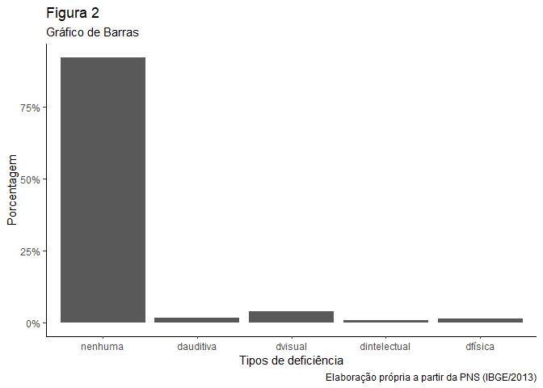<!-- -->

Entre as pessoas com deficiência a distribuição das pessoas de acordo
com a categoria do grau de limitação da deficiência é: 2,73% declararam
que a deficiência não limita, 1,94%, que limita um pouco, 1,36%, que
limita moderadamente e 1,84% responderam que a deficiência limita
intensamente a realização das atividades habituais. A Figura 3 demonstra
esses dados num gráfico de barras.

``` r
table(filtrado_idade$limita)
```

    ## 
    ##    não limita moderadamente  intensamente      um pouco 
    ##          4395          2196          2969          3135

``` r
#não limita     
(4395/160902)*100
```

    ## [1] 2.731476

``` r
#um pouco 
(3135/160902)*100
```

    ## [1] 1.948391

``` r
#moderadamente    
(2196/160902)*100
```

    ## [1] 1.364806

``` r
#intensamente 
(2969/160902)*100
```

    ## [1] 1.845223

``` r
ggplot(filtrado_idade, aes(limita, ..count../sum(..count..))) +
  geom_bar(na.rm = T) +
  scale_y_continuous(labels = percent)+
  labs(title = "Figura 3",
subtitle = "Gráfico de Barras",
x = "Limitação decorrente da deficiência",
y = "Porcentagem",
caption = "Elaboração própria a partir da PNS (IBGE/2013)") +
  theme_classic () 
```

<!-- -->

No caso da variável renda a média é 939,70 reais, a mediana é igual a
400 reais, ou seja, 50% dos respondentes tem um rendimento bruto mensal
menor que 400 reais. O terceiro quartio é igual a mil reais, ou seja,
75% das pessoas tem um rendimento menor que esse valor. De acordo com a
Figura 4, o rendimento mensal máximo da distribuição é de 400.000 reais.
O box-plot demonstra que a maior parte da população se concentra na
parte mais próxima do rendimento bruto mensal abaixo de mil reais.

``` r
summary(filtrado_idade$salario)
```

    ##     Min.  1st Qu.   Median     Mean  3rd Qu.     Max. 
    ##      0.0      0.0    400.0    939.7   1000.0 400000.0

``` r
ggplot(filtrado_idade, aes("",salario)) +
  geom_boxplot()+
  labs(title = "Figura 4",
subtitle = "Gráfico de Box-Plot",
x = "",
y = "Rendimento bruto mensal",
caption = "Elaboração própria a partir da PNS (IBGE/2013)") +
  theme_classic () 
```

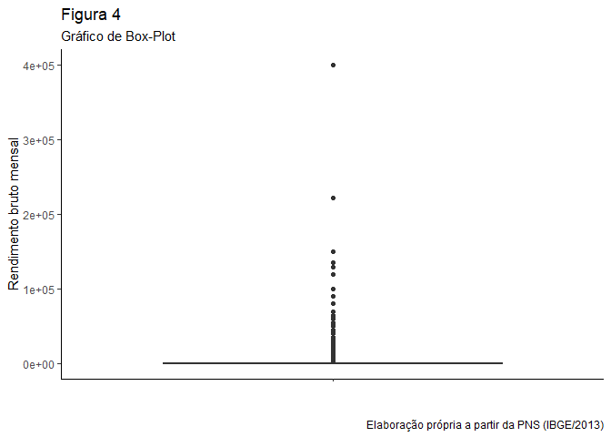<!-- -->

Ao comparar a renda com a deficiência, a média de salarial de todas as
categorias fica abaixo de mil reais. Na categoria dos que não têm
deficiência a média salarial é 971,41 reais, na categoria de
deficiência auditiva, é 573,30 reais, para os deficientes físicos, é
422,04 reais, os deficientes intelectuais têm em média um rendimento
bruto mensal de 40,13 reais e os deficiente visuais têm em média um
rendimento de 727,60 reais. De acordo com o gráfico da Figura 5 a
observação que indica o rendimento mensal de 400.000 reais, como foi
observado na Figura 4, pertence a categoria das pessoas que não têm
deficiência. O rendimento máximo da categoria de pessoas com deficiência
visual é de 100.000 reais, já a categoria da deficiência intelectual
possui um rendimento máximo de 2.500 reais, na deficiência física esse
valor é de 21.000 reais e na auditiva é de 25.000 reais.

``` r
banco_descritivo <- filtrado_idade %>%
  group_by (deficiencia) %>%
   summarise (media = mean(salario, na.rm = TRUE), 
              mediana = median(salario, na.rm = TRUE), 
              minimo = min(salario, na.rm = TRUE),
              maximo = max(salario, na.rm = TRUE),
              desvio = sd(salario, na.rm = TRUE),
              .groups = 'drop')           
   

ggplot(filtrado_idade, aes(deficiencia, salario)) +
geom_boxplot ()+
  labs(title = "Figura 5",
subtitle = "Gráfico de Box-Plot",
x = "Tipos de deficiência",
y = "Rendimento bruto mensal",
caption = "Elaboração própria a partir da PNS (IBGE/2013)") +
  theme_classic () 
```

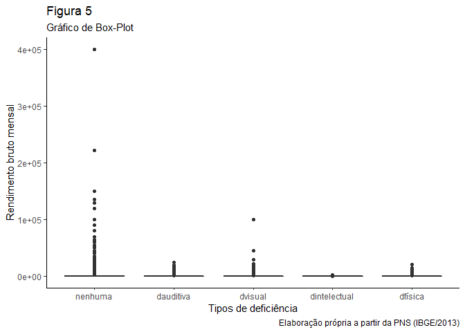<!-- -->

Esses resultados descritivos sem nenhum controle demonstram que existe
uma diferença na remuneração de acordo com o tipo de deficiência e que a
diferença também é significativa entre as pessoas com deficiência e as
que não têm deficiência. Sendo assim é necessário avaliar os dados com
maior precisão.

## 5 Resultados

A primeira regressão feita para testar a H1 demonstrou que duas
observações no modelo são influentes \[6\] e por isso foram retiradas.
Na Figura 6 é possível ver a comparação dos dois modelos, o *model 1* é
o que possui as observações influentes, o *model 2* é sem as observações
inflientes.

``` r
dwplot (list (regressao1, regressao2), vline = geom_vline(xintercept = 0, linetype = "dashed"), by_2sd = T) +
  labs(title = "Figura 6",
subtitle = "Gráfico Intervalos de Confiança",
x = "",
y = "",
caption = "Elaboração própria a partir da PNS (IBGE/2013)") +
  theme_classic () 
```

<!-- -->

``` r
stargazer(list(regressao1,
               regressao2),
          type='html')
```

    ## 
    ## <table style="text-align:center"><tr><td colspan="3" style="border-bottom: 1px solid black"></td></tr><tr><td style="text-align:left"></td><td colspan="2"><em>Dependent variable:</em></td></tr>
    ## <tr><td></td><td colspan="2" style="border-bottom: 1px solid black"></td></tr>
    ## <tr><td style="text-align:left"></td><td colspan="2">salario</td></tr>
    ## <tr><td style="text-align:left"></td><td>(1)</td><td>(2)</td></tr>
    ## <tr><td colspan="3" style="border-bottom: 1px solid black"></td></tr><tr><td style="text-align:left">deficienciadauditiva</td><td>-220.290<sup>***</sup></td><td>-198.775<sup>***</sup></td></tr>
    ## <tr><td style="text-align:left"></td><td>(46.442)</td><td>(36.901)</td></tr>
    ## <tr><td style="text-align:left"></td><td></td><td></td></tr>
    ## <tr><td style="text-align:left">deficienciadvisual</td><td>-104.472<sup>***</sup></td><td>-91.684<sup>***</sup></td></tr>
    ## <tr><td style="text-align:left"></td><td>(32.300)</td><td>(25.665)</td></tr>
    ## <tr><td style="text-align:left"></td><td></td><td></td></tr>
    ## <tr><td style="text-align:left">deficienciadintelectual</td><td>24.291</td><td>29.797</td></tr>
    ## <tr><td style="text-align:left"></td><td>(70.806)</td><td>(56.260)</td></tr>
    ## <tr><td style="text-align:left"></td><td></td><td></td></tr>
    ## <tr><td style="text-align:left">deficienciadfísica</td><td>-214.074<sup>***</sup></td><td>-198.959<sup>***</sup></td></tr>
    ## <tr><td style="text-align:left"></td><td>(53.058)</td><td>(42.159)</td></tr>
    ## <tr><td style="text-align:left"></td><td></td><td></td></tr>
    ## <tr><td style="text-align:left">idade</td><td>10.653<sup>***</sup></td><td>10.600<sup>***</sup></td></tr>
    ## <tr><td style="text-align:left"></td><td>(0.409)</td><td>(0.325)</td></tr>
    ## <tr><td style="text-align:left"></td><td></td><td></td></tr>
    ## <tr><td style="text-align:left">sexofeminino</td><td>-448.853<sup>***</sup></td><td>-436.902<sup>***</sup></td></tr>
    ## <tr><td style="text-align:left"></td><td>(12.790)</td><td>(10.162)</td></tr>
    ## <tr><td style="text-align:left"></td><td></td><td></td></tr>
    ## <tr><td style="text-align:left">trabalhonão</td><td>-1,167.884<sup>***</sup></td><td>-1,152.752<sup>***</sup></td></tr>
    ## <tr><td style="text-align:left"></td><td>(13.966)</td><td>(11.097)</td></tr>
    ## <tr><td style="text-align:left"></td><td></td><td></td></tr>
    ## <tr><td style="text-align:left">escolaridadefund_completo</td><td>212.109<sup>***</sup></td><td>211.378<sup>***</sup></td></tr>
    ## <tr><td style="text-align:left"></td><td>(25.701)</td><td>(20.422)</td></tr>
    ## <tr><td style="text-align:left"></td><td></td><td></td></tr>
    ## <tr><td style="text-align:left">escolaridadefund_incompleto</td><td>75.519<sup>***</sup></td><td>75.762<sup>***</sup></td></tr>
    ## <tr><td style="text-align:left"></td><td>(20.826)</td><td>(16.547)</td></tr>
    ## <tr><td style="text-align:left"></td><td></td><td></td></tr>
    ## <tr><td style="text-align:left">escolaridademédio_completo</td><td>395.719<sup>***</sup></td><td>399.035<sup>***</sup></td></tr>
    ## <tr><td style="text-align:left"></td><td>(21.822)</td><td>(17.339)</td></tr>
    ## <tr><td style="text-align:left"></td><td></td><td></td></tr>
    ## <tr><td style="text-align:left">escolaridademédio_incompleto</td><td>244.044<sup>***</sup></td><td>240.006<sup>***</sup></td></tr>
    ## <tr><td style="text-align:left"></td><td>(29.462)</td><td>(23.410)</td></tr>
    ## <tr><td style="text-align:left"></td><td></td><td></td></tr>
    ## <tr><td style="text-align:left">escolaridadesup_completo</td><td>2,529.928<sup>***</sup></td><td>2,493.736<sup>***</sup></td></tr>
    ## <tr><td style="text-align:left"></td><td>(26.281)</td><td>(20.883)</td></tr>
    ## <tr><td style="text-align:left"></td><td></td><td></td></tr>
    ## <tr><td style="text-align:left">escolaridadesup_incompleto</td><td>597.644<sup>***</sup></td><td>599.245<sup>***</sup></td></tr>
    ## <tr><td style="text-align:left"></td><td>(33.145)</td><td>(26.336)</td></tr>
    ## <tr><td style="text-align:left"></td><td></td><td></td></tr>
    ## <tr><td style="text-align:left">renda_domiciliar</td><td>0.010</td><td>-0.019<sup>***</sup></td></tr>
    ## <tr><td style="text-align:left"></td><td>(0.007)</td><td>(0.005)</td></tr>
    ## <tr><td style="text-align:left"></td><td></td><td></td></tr>
    ## <tr><td style="text-align:left">cornão_branco</td><td>-216.202<sup>***</sup></td><td>-210.573<sup>***</sup></td></tr>
    ## <tr><td style="text-align:left"></td><td>(13.788)</td><td>(10.956)</td></tr>
    ## <tr><td style="text-align:left"></td><td></td><td></td></tr>
    ## <tr><td style="text-align:left">regiaoNorte</td><td>133.258<sup>***</sup></td><td>131.598<sup>***</sup></td></tr>
    ## <tr><td style="text-align:left"></td><td>(17.014)</td><td>(13.518)</td></tr>
    ## <tr><td style="text-align:left"></td><td></td><td></td></tr>
    ## <tr><td style="text-align:left">regiaoSudeste</td><td>232.554<sup>***</sup></td><td>218.179<sup>***</sup></td></tr>
    ## <tr><td style="text-align:left"></td><td>(17.359)</td><td>(13.793)</td></tr>
    ## <tr><td style="text-align:left"></td><td></td><td></td></tr>
    ## <tr><td style="text-align:left">regiaoSul</td><td>218.337<sup>***</sup></td><td>218.079<sup>***</sup></td></tr>
    ## <tr><td style="text-align:left"></td><td>(22.453)</td><td>(17.841)</td></tr>
    ## <tr><td style="text-align:left"></td><td></td><td></td></tr>
    ## <tr><td style="text-align:left">regiaoCentro-oeste</td><td>346.727<sup>***</sup></td><td>352.677<sup>***</sup></td></tr>
    ## <tr><td style="text-align:left"></td><td>(21.084)</td><td>(16.752)</td></tr>
    ## <tr><td style="text-align:left"></td><td></td><td></td></tr>
    ## <tr><td style="text-align:left">Constant</td><td>722.397<sup>***</sup></td><td>717.003<sup>***</sup></td></tr>
    ## <tr><td style="text-align:left"></td><td>(30.642)</td><td>(24.348)</td></tr>
    ## <tr><td style="text-align:left"></td><td></td><td></td></tr>
    ## <tr><td colspan="3" style="border-bottom: 1px solid black"></td></tr><tr><td style="text-align:left">Observations</td><td>160,902</td><td>160,899</td></tr>
    ## <tr><td style="text-align:left">R<sup>2</sup></td><td>0.169</td><td>0.238</td></tr>
    ## <tr><td style="text-align:left">Adjusted R<sup>2</sup></td><td>0.169</td><td>0.238</td></tr>
    ## <tr><td style="text-align:left">Residual Std. Error</td><td>2,466.309 (df = 160882)</td><td>1,959.659 (df = 160879)</td></tr>
    ## <tr><td style="text-align:left">F Statistic</td><td>1,722.607<sup>***</sup> (df = 19; 160882)</td><td>2,639.278<sup>***</sup> (df = 19; 160879)</td></tr>
    ## <tr><td colspan="3" style="border-bottom: 1px solid black"></td></tr><tr><td style="text-align:left"><em>Note:</em></td><td colspan="2" style="text-align:right"><sup>*</sup>p<0.1; <sup>**</sup>p<0.05; <sup>***</sup>p<0.01</td></tr>
    ## </table>

``` r
dwplot (list (regressao3, regressao4), vline = geom_vline(xintercept = 0, linetype = "dashed"), by_2sd = T) +
  labs(title = "Figura 7",
subtitle = "Gráfico Intervalos de Confiança",
x = "",
y = "",
caption = "Elaboração própria a partir da PNS (IBGE/2013)") +
  theme_classic ()
```

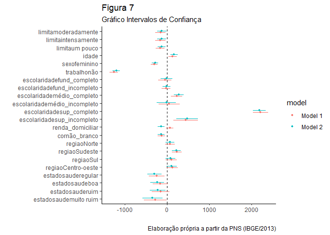<!-- -->

``` r
stargazer(list(regressao3,
               regressao4),
          type='html')
```

    ## 
    ## <table style="text-align:center"><tr><td colspan="3" style="border-bottom: 1px solid black"></td></tr><tr><td style="text-align:left"></td><td colspan="2"><em>Dependent variable:</em></td></tr>
    ## <tr><td></td><td colspan="2" style="border-bottom: 1px solid black"></td></tr>
    ## <tr><td style="text-align:left"></td><td colspan="2">salario</td></tr>
    ## <tr><td style="text-align:left"></td><td>(1)</td><td>(2)</td></tr>
    ## <tr><td colspan="3" style="border-bottom: 1px solid black"></td></tr><tr><td style="text-align:left">limitamoderadamente</td><td>-160.996<sup>***</sup></td><td>-127.128<sup>**</sup></td></tr>
    ## <tr><td style="text-align:left"></td><td>(61.815)</td><td>(54.710)</td></tr>
    ## <tr><td style="text-align:left"></td><td></td><td></td></tr>
    ## <tr><td style="text-align:left">limitaintensamente</td><td>-164.643<sup>***</sup></td><td>-135.150<sup>**</sup></td></tr>
    ## <tr><td style="text-align:left"></td><td>(61.509)</td><td>(54.437)</td></tr>
    ## <tr><td style="text-align:left"></td><td></td><td></td></tr>
    ## <tr><td style="text-align:left">limitaum pouco</td><td>-163.713<sup>***</sup></td><td>-129.769<sup>***</sup></td></tr>
    ## <tr><td style="text-align:left"></td><td>(54.254)</td><td>(48.020)</td></tr>
    ## <tr><td style="text-align:left"></td><td></td><td></td></tr>
    ## <tr><td style="text-align:left">idade</td><td>3.665<sup>***</sup></td><td>4.664<sup>***</sup></td></tr>
    ## <tr><td style="text-align:left"></td><td>(1.412)</td><td>(1.250)</td></tr>
    ## <tr><td style="text-align:left"></td><td></td><td></td></tr>
    ## <tr><td style="text-align:left">sexofeminino</td><td>-306.823<sup>***</sup></td><td>-288.977<sup>***</sup></td></tr>
    ## <tr><td style="text-align:left"></td><td>(42.307)</td><td>(37.442)</td></tr>
    ## <tr><td style="text-align:left"></td><td></td><td></td></tr>
    ## <tr><td style="text-align:left">trabalhonão</td><td>-1,266.545<sup>***</sup></td><td>-1,203.892<sup>***</sup></td></tr>
    ## <tr><td style="text-align:left"></td><td>(49.935)</td><td>(44.246)</td></tr>
    ## <tr><td style="text-align:left"></td><td></td><td></td></tr>
    ## <tr><td style="text-align:left">escolaridadefund_completo</td><td>-56.721</td><td>-19.773</td></tr>
    ## <tr><td style="text-align:left"></td><td>(81.775)</td><td>(72.375)</td></tr>
    ## <tr><td style="text-align:left"></td><td></td><td></td></tr>
    ## <tr><td style="text-align:left">escolaridadefund_incompleto</td><td>-32.355</td><td>-12.687</td></tr>
    ## <tr><td style="text-align:left"></td><td>(53.568)</td><td>(47.408)</td></tr>
    ## <tr><td style="text-align:left"></td><td></td><td></td></tr>
    ## <tr><td style="text-align:left">escolaridademédio_completo</td><td>224.763<sup>***</sup></td><td>273.830<sup>***</sup></td></tr>
    ## <tr><td style="text-align:left"></td><td>(69.133)</td><td>(61.204)</td></tr>
    ## <tr><td style="text-align:left"></td><td></td><td></td></tr>
    ## <tr><td style="text-align:left">escolaridademédio_incompleto</td><td>44.066</td><td>-21.293</td></tr>
    ## <tr><td style="text-align:left"></td><td>(128.820)</td><td>(114.244)</td></tr>
    ## <tr><td style="text-align:left"></td><td></td><td></td></tr>
    ## <tr><td style="text-align:left">escolaridadesup_completo</td><td>2,211.125<sup>***</sup></td><td>2,184.081<sup>***</sup></td></tr>
    ## <tr><td style="text-align:left"></td><td>(89.276)</td><td>(79.091)</td></tr>
    ## <tr><td style="text-align:left"></td><td></td><td></td></tr>
    ## <tr><td style="text-align:left">escolaridadesup_incompleto</td><td>437.544<sup>***</sup></td><td>471.115<sup>***</sup></td></tr>
    ## <tr><td style="text-align:left"></td><td>(146.400)</td><td>(129.559)</td></tr>
    ## <tr><td style="text-align:left"></td><td></td><td></td></tr>
    ## <tr><td style="text-align:left">renda_domiciliar</td><td>0.020</td><td>-0.049<sup>***</sup></td></tr>
    ## <tr><td style="text-align:left"></td><td>(0.015)</td><td>(0.014)</td></tr>
    ## <tr><td style="text-align:left"></td><td></td><td></td></tr>
    ## <tr><td style="text-align:left">cornão_branco</td><td>-136.343<sup>***</sup></td><td>-144.064<sup>***</sup></td></tr>
    ## <tr><td style="text-align:left"></td><td>(45.806)</td><td>(40.541)</td></tr>
    ## <tr><td style="text-align:left"></td><td></td><td></td></tr>
    ## <tr><td style="text-align:left">regiaoNorte</td><td>65.047</td><td>68.478</td></tr>
    ## <tr><td style="text-align:left"></td><td>(59.858)</td><td>(52.970)</td></tr>
    ## <tr><td style="text-align:left"></td><td></td><td></td></tr>
    ## <tr><td style="text-align:left">regiaoSudeste</td><td>229.127<sup>***</sup></td><td>221.181<sup>***</sup></td></tr>
    ## <tr><td style="text-align:left"></td><td>(60.087)</td><td>(53.177)</td></tr>
    ## <tr><td style="text-align:left"></td><td></td><td></td></tr>
    ## <tr><td style="text-align:left">regiaoSul</td><td>96.290</td><td>76.261</td></tr>
    ## <tr><td style="text-align:left"></td><td>(68.351)</td><td>(60.506)</td></tr>
    ## <tr><td style="text-align:left"></td><td></td><td></td></tr>
    ## <tr><td style="text-align:left">regiaoCentro-oeste</td><td>118.498<sup>*</sup></td><td>101.582</td></tr>
    ## <tr><td style="text-align:left"></td><td>(70.368)</td><td>(62.297)</td></tr>
    ## <tr><td style="text-align:left"></td><td></td><td></td></tr>
    ## <tr><td style="text-align:left">estadosauderegular</td><td>-245.609<sup>***</sup></td><td>-302.730<sup>***</sup></td></tr>
    ## <tr><td style="text-align:left"></td><td>(95.239)</td><td>(84.293)</td></tr>
    ## <tr><td style="text-align:left"></td><td></td><td></td></tr>
    ## <tr><td style="text-align:left">estadosaudeboa</td><td>-163.744<sup>*</sup></td><td>-241.733<sup>***</sup></td></tr>
    ## <tr><td style="text-align:left"></td><td>(93.533)</td><td>(82.795)</td></tr>
    ## <tr><td style="text-align:left"></td><td></td><td></td></tr>
    ## <tr><td style="text-align:left">estadosauderuim</td><td>-155.541</td><td>-228.015<sup>**</sup></td></tr>
    ## <tr><td style="text-align:left"></td><td>(108.226)</td><td>(95.792)</td></tr>
    ## <tr><td style="text-align:left"></td><td></td><td></td></tr>
    ## <tr><td style="text-align:left">estadosaudemuito ruim</td><td>-282.616<sup>**</sup></td><td>-351.607<sup>***</sup></td></tr>
    ## <tr><td style="text-align:left"></td><td>(137.981)</td><td>(122.117)</td></tr>
    ## <tr><td style="text-align:left"></td><td></td><td></td></tr>
    ## <tr><td style="text-align:left">Constant</td><td>1,382.880<sup>***</sup></td><td>1,356.849<sup>***</sup></td></tr>
    ## <tr><td style="text-align:left"></td><td>(135.270)</td><td>(119.722)</td></tr>
    ## <tr><td style="text-align:left"></td><td></td><td></td></tr>
    ## <tr><td colspan="3" style="border-bottom: 1px solid black"></td></tr><tr><td style="text-align:left">Observations</td><td>5,524</td><td>5,521</td></tr>
    ## <tr><td style="text-align:left">R<sup>2</sup></td><td>0.306</td><td>0.341</td></tr>
    ## <tr><td style="text-align:left">Adjusted R<sup>2</sup></td><td>0.303</td><td>0.339</td></tr>
    ## <tr><td style="text-align:left">Residual Std. Error</td><td>1,520.190 (df = 5501)</td><td>1,345.250 (df = 5498)</td></tr>
    ## <tr><td style="text-align:left">F Statistic</td><td>110.179<sup>***</sup> (df = 22; 5501)</td><td>129.546<sup>***</sup> (df = 22; 5498)</td></tr>
    ## <tr><td colspan="3" style="border-bottom: 1px solid black"></td></tr><tr><td style="text-align:left"><em>Note:</em></td><td colspan="2" style="text-align:right"><sup>*</sup>p<0.1; <sup>**</sup>p<0.05; <sup>***</sup>p<0.01</td></tr>
    ## </table>

``` r
dwplot (list (regressao5, regressao6), vline = geom_vline(xintercept = 0, linetype = "dashed"), by_2sd = T) +
  labs(title = "Figura 8",
subtitle = "Gráfico Intervalos de Confiança",
x = "",
y = "",
caption = "Elaboração própria a partir da PNS (IBGE/2013)")+
  theme_classic ()
```

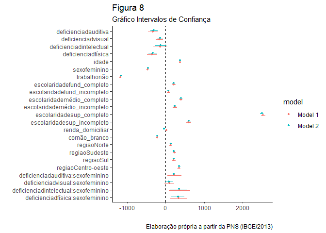<!-- -->

``` r
stargazer(list(regressao5,
               regressao6),
          type='html')
```

    ## 
    ## <table style="text-align:center"><tr><td colspan="3" style="border-bottom: 1px solid black"></td></tr><tr><td style="text-align:left"></td><td colspan="2"><em>Dependent variable:</em></td></tr>
    ## <tr><td></td><td colspan="2" style="border-bottom: 1px solid black"></td></tr>
    ## <tr><td style="text-align:left"></td><td colspan="2">salario</td></tr>
    ## <tr><td style="text-align:left"></td><td>(1)</td><td>(2)</td></tr>
    ## <tr><td colspan="3" style="border-bottom: 1px solid black"></td></tr><tr><td style="text-align:left">deficienciadauditiva</td><td>-326.843<sup>***</sup></td><td>-297.833<sup>***</sup></td></tr>
    ## <tr><td style="text-align:left"></td><td>(62.382)</td><td>(49.565)</td></tr>
    ## <tr><td style="text-align:left"></td><td></td><td></td></tr>
    ## <tr><td style="text-align:left">deficienciadvisual</td><td>-161.702<sup>***</sup></td><td>-138.416<sup>***</sup></td></tr>
    ## <tr><td style="text-align:left"></td><td>(48.971)</td><td>(38.910)</td></tr>
    ## <tr><td style="text-align:left"></td><td></td><td></td></tr>
    ## <tr><td style="text-align:left">deficienciadintelectual</td><td>-136.147</td><td>-125.140<sup>*</sup></td></tr>
    ## <tr><td style="text-align:left"></td><td>(94.574)</td><td>(75.144)</td></tr>
    ## <tr><td style="text-align:left"></td><td></td><td></td></tr>
    ## <tr><td style="text-align:left">deficienciadfísica</td><td>-349.179<sup>***</sup></td><td>-328.935<sup>***</sup></td></tr>
    ## <tr><td style="text-align:left"></td><td>(68.195)</td><td>(54.185)</td></tr>
    ## <tr><td style="text-align:left"></td><td></td><td></td></tr>
    ## <tr><td style="text-align:left">idade</td><td>10.627<sup>***</sup></td><td>10.575<sup>***</sup></td></tr>
    ## <tr><td style="text-align:left"></td><td>(0.409)</td><td>(0.325)</td></tr>
    ## <tr><td style="text-align:left"></td><td></td><td></td></tr>
    ## <tr><td style="text-align:left">sexofeminino</td><td>-464.500<sup>***</sup></td><td>-451.270<sup>***</sup></td></tr>
    ## <tr><td style="text-align:left"></td><td>(13.291)</td><td>(10.561)</td></tr>
    ## <tr><td style="text-align:left"></td><td></td><td></td></tr>
    ## <tr><td style="text-align:left">trabalhonão</td><td>-1,166.766<sup>***</sup></td><td>-1,151.692<sup>***</sup></td></tr>
    ## <tr><td style="text-align:left"></td><td>(13.968)</td><td>(11.099)</td></tr>
    ## <tr><td style="text-align:left"></td><td></td><td></td></tr>
    ## <tr><td style="text-align:left">escolaridadefund_completo</td><td>211.932<sup>***</sup></td><td>211.210<sup>***</sup></td></tr>
    ## <tr><td style="text-align:left"></td><td>(25.700)</td><td>(20.420)</td></tr>
    ## <tr><td style="text-align:left"></td><td></td><td></td></tr>
    ## <tr><td style="text-align:left">escolaridadefund_incompleto</td><td>75.727<sup>***</sup></td><td>75.964<sup>***</sup></td></tr>
    ## <tr><td style="text-align:left"></td><td>(20.825)</td><td>(16.546)</td></tr>
    ## <tr><td style="text-align:left"></td><td></td><td></td></tr>
    ## <tr><td style="text-align:left">escolaridademédio_completo</td><td>396.263<sup>***</sup></td><td>399.534<sup>***</sup></td></tr>
    ## <tr><td style="text-align:left"></td><td>(21.821)</td><td>(17.338)</td></tr>
    ## <tr><td style="text-align:left"></td><td></td><td></td></tr>
    ## <tr><td style="text-align:left">escolaridademédio_incompleto</td><td>244.130<sup>***</sup></td><td>240.082<sup>***</sup></td></tr>
    ## <tr><td style="text-align:left"></td><td>(29.460)</td><td>(23.408)</td></tr>
    ## <tr><td style="text-align:left"></td><td></td><td></td></tr>
    ## <tr><td style="text-align:left">escolaridadesup_completo</td><td>2,531.155<sup>***</sup></td><td>2,494.871<sup>***</sup></td></tr>
    ## <tr><td style="text-align:left"></td><td>(26.281)</td><td>(20.882)</td></tr>
    ## <tr><td style="text-align:left"></td><td></td><td></td></tr>
    ## <tr><td style="text-align:left">escolaridadesup_incompleto</td><td>598.291<sup>***</sup></td><td>599.830<sup>***</sup></td></tr>
    ## <tr><td style="text-align:left"></td><td>(33.144)</td><td>(26.334)</td></tr>
    ## <tr><td style="text-align:left"></td><td></td><td></td></tr>
    ## <tr><td style="text-align:left">renda_domiciliar</td><td>0.011</td><td>-0.019<sup>***</sup></td></tr>
    ## <tr><td style="text-align:left"></td><td>(0.007)</td><td>(0.005)</td></tr>
    ## <tr><td style="text-align:left"></td><td></td><td></td></tr>
    ## <tr><td style="text-align:left">cornão_branco</td><td>-215.718<sup>***</sup></td><td>-210.113<sup>***</sup></td></tr>
    ## <tr><td style="text-align:left"></td><td>(13.788)</td><td>(10.955)</td></tr>
    ## <tr><td style="text-align:left"></td><td></td><td></td></tr>
    ## <tr><td style="text-align:left">regiaoNorte</td><td>133.258<sup>***</sup></td><td>131.597<sup>***</sup></td></tr>
    ## <tr><td style="text-align:left"></td><td>(17.013)</td><td>(13.517)</td></tr>
    ## <tr><td style="text-align:left"></td><td></td><td></td></tr>
    ## <tr><td style="text-align:left">regiaoSudeste</td><td>232.567<sup>***</sup></td><td>218.200<sup>***</sup></td></tr>
    ## <tr><td style="text-align:left"></td><td>(17.358)</td><td>(13.792)</td></tr>
    ## <tr><td style="text-align:left"></td><td></td><td></td></tr>
    ## <tr><td style="text-align:left">regiaoSul</td><td>217.818<sup>***</sup></td><td>217.605<sup>***</sup></td></tr>
    ## <tr><td style="text-align:left"></td><td>(22.453)</td><td>(17.840)</td></tr>
    ## <tr><td style="text-align:left"></td><td></td><td></td></tr>
    ## <tr><td style="text-align:left">regiaoCentro-oeste</td><td>346.613<sup>***</sup></td><td>352.568<sup>***</sup></td></tr>
    ## <tr><td style="text-align:left"></td><td>(21.082)</td><td>(16.751)</td></tr>
    ## <tr><td style="text-align:left"></td><td></td><td></td></tr>
    ## <tr><td style="text-align:left">deficienciadauditiva:sexofeminino</td><td>233.861<sup>**</sup></td><td>217.484<sup>***</sup></td></tr>
    ## <tr><td style="text-align:left"></td><td>(91.840)</td><td>(72.971)</td></tr>
    ## <tr><td style="text-align:left"></td><td></td><td></td></tr>
    ## <tr><td style="text-align:left">deficienciadvisual:sexofeminino</td><td>101.596</td><td>83.167</td></tr>
    ## <tr><td style="text-align:left"></td><td>(64.392)</td><td>(51.163)</td></tr>
    ## <tr><td style="text-align:left"></td><td></td><td></td></tr>
    ## <tr><td style="text-align:left">deficienciadintelectual:sexofeminino</td><td>357.906<sup>**</sup></td><td>345.777<sup>***</sup></td></tr>
    ## <tr><td style="text-align:left"></td><td>(140.862)</td><td>(111.921)</td></tr>
    ## <tr><td style="text-align:left"></td><td></td><td></td></tr>
    ## <tr><td style="text-align:left">deficienciadfísica:sexofeminino</td><td>335.742<sup>***</sup></td><td>323.238<sup>***</sup></td></tr>
    ## <tr><td style="text-align:left"></td><td>(107.611)</td><td>(85.502)</td></tr>
    ## <tr><td style="text-align:left"></td><td></td><td></td></tr>
    ## <tr><td style="text-align:left">Constant</td><td>730.564<sup>***</sup></td><td>724.529<sup>***</sup></td></tr>
    ## <tr><td style="text-align:left"></td><td>(30.695)</td><td>(24.389)</td></tr>
    ## <tr><td style="text-align:left"></td><td></td><td></td></tr>
    ## <tr><td colspan="3" style="border-bottom: 1px solid black"></td></tr><tr><td style="text-align:left">Observations</td><td>160,902</td><td>160,899</td></tr>
    ## <tr><td style="text-align:left">R<sup>2</sup></td><td>0.169</td><td>0.238</td></tr>
    ## <tr><td style="text-align:left">Adjusted R<sup>2</sup></td><td>0.169</td><td>0.238</td></tr>
    ## <tr><td style="text-align:left">Residual Std. Error</td><td>2,466.155 (df = 160878)</td><td>1,959.477 (df = 160875)</td></tr>
    ## <tr><td style="text-align:left">F Statistic</td><td>1,424.245<sup>***</sup> (df = 23; 160878)</td><td>2,182.149<sup>***</sup> (df = 23; 160875)</td></tr>
    ## <tr><td colspan="3" style="border-bottom: 1px solid black"></td></tr><tr><td style="text-align:left"><em>Note:</em></td><td colspan="2" style="text-align:right"><sup>*</sup>p<0.1; <sup>**</sup>p<0.05; <sup>***</sup>p<0.01</td></tr>
    ## </table>

``` r
plot_model(regressao5, type = "pred", 
           terms = c("deficiencia", "sexo"), 
           ci.lvl = 0.9)+
labs(title = "Figura 9",
subtitle = "Gráfico Variáveis de Interação",
x = "Tipos de deficiência",
y = "Rendimento bruto mensal",
caption = "Elaboração própria a partir da PNS (IBGE/2013)") +
  theme_classic () 
```

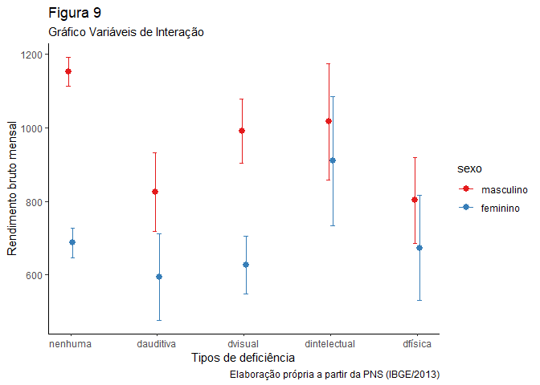<!-- -->

## 6 Conclusão

## Referências

## Anexo

### Dicionário de variáveis da PNS

Utilizadas: Unidade da federação: V0001 Módulo C: características gerais
dos moradores - C001 até C012 Módulo D: características de educação das
pessoas de 5 anos ou mais de idade - D001 até D015 Módulo E: trabalho
dos moradores do domicílio - E001 até E027 Módulo F: rendimentos
domiciliares F001 até VDF00102 Módulo G: pessoas com deficiências - G001
até G032 Módulo M: informações para futuros contatos, características de
trabalho e apoio social - M001 até M019 Módulo N: percepção do estado de
saúde - N001 até N023 Módulo W – informações laboratoriais - W00101 até
W00408 Variáveis de amostragem: V0028 até V00293 Variáveis derivadas do
morador: VDD004 (Nível de instrução mais elevado alcançado (pessoas de 5
anos ou mais de idade)); VDE001 (Condição em relação à força de trabalho
na semana de referência para pessoas de 14 anos ou mais de idade);
VDE002 (Condição de ocupação na semana de referência para pessoas de 14
anos ou mais de idade); VDDATAM (Data de geração do arquivo de
microdados. Data ordenada na forma: ano (4 algarismos), mês (2) e dia
(2) - AAAAMMDD)

Retiradas V0024: Estrato UPA\_PNS: UPA V0006\_PN: Número de ordem do
domicílio na PNS UPA: Código da UPA das Pesquisas Domiciliares do
Sistema Integrado V0025: Seleção do morador de 18 anos ou mais para
responder o questionário individual Módulo I: cobertura de plano de
saúde - I001 até I011 Módulo J: utilização de serviços de saúde - J001
até J060 Módulo K: idosos - K001 até K062 Módulo L: crianças com menos
de 2 anos - L00201 até L020 Módulo O: acidentes e violências - O001 até
O048 Módulo P: estilos de vida - P001 até P072 Módulo Q: doenças
crônicas - Q001 até Q137 Módulo R: saúde da mulher (mulheres de 18 anos
e mais de idade) - R001 até R04903 Módulo S: atendimento pré-natal -
S001 até S058 Módulo U: saúde bucal - U001 até U025 Módulo X:
atendimento médico - X001 até X02510

1.  A deficiência intelectual pode estar associada a síndromes ou
    transtornos de desenvolvimento como a síndrome de Down, autismo,
    paralisia cerebral, acidente vascular cerebral, derrame, aneurisma,
    epilepsia ou demência senil. A deficiência física refere-se a
    alteração completa ou parcial de um ou mais segmentos do corpo, que
    podem ser decorrentes da amputação ou ausência do segmento,
    paralisia permanente, deformidade congênita, ostomia, nanismo,
    deficiência motora decorrente da poliomielite ou paralisia infantil.
    A deficiência auditiva refere-se a audição reduzida ou surdez de um
    ou ambos os ouvidos, e a deficiência visual refere-se a baixa visão
    ou cegueira de um ou de ambos os olhos (BECKER, 2019).

2.  Direito garantido pela Constituição Federal de 1988, regulamentado
    pela Lei Orgânica da Assistência Social (LOAS), Lei nº 8.742/93 e
    pelas Leis nº:12.435/2011, nº 12.470/2011 e nº 13.146/2015, que
    alteram dispositivos da LOAS; e pelos Decretos nº 6.214/2007, nº
    6.564/2008 e nº 7.617/2011, assegura 1 (um) salário mínimo mensal ao
    idoso, com idade de 65 anos ou mais, e à pessoa com deficiência, de
    qualquer idade, com impedimentos de longo prazo, de natureza física,
    mental, intelectual ou sensorial, que comprove não possuir meios de
    garantir o próprio sustento, nem tê-lo provido por sua família. Em
    ambos os casos, é necessário que a renda mensal bruta familiar per
    capita seja inferior a ¼ (um quarto) do salário mínimo vigente.

3.  Para mais informações ver:
    <https://www.ibge.gov.br/estatisticas/sociais/saude/9160-pesquisa-nacional-de-saude.html?=&t=o-que-e>

4.  Período de coleta - 27/07/2013; Semana - 21/07/2013 a 27/07/2013;
    Mês - 01/07/2013 a 31/07/2013; Mês - 28/06/2013 a 27/07/2013.

5.  No módulo G do questionário foram feitas quatro perguntas que se
    referiam à existência da deficiência: tem deficiência intelectual?/
    tem alguma deficiência física?/ tem deficiência auditiva?/ tem
    deficiência visual? (Ver:
    <https://www.ibge.gov.br/estatisticas/sociais/saude/9160-pesquisa-nacional-de-saude.html?=&t=downloads>

6.  Para mais informações olhar o Anexo na seção Pressupostos da
    regressão H1
